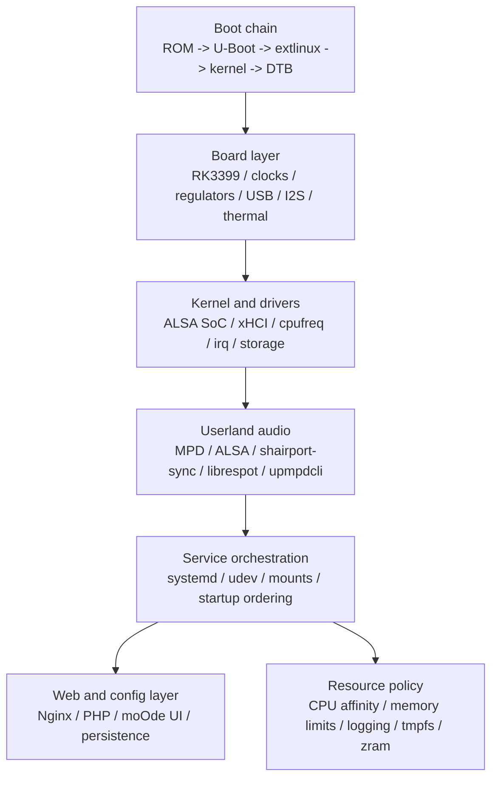

# Archived: Lumelo 在 NanoPC-T4 / RK3399 上的 moOde 重改级移植蓝图

> 废弃说明：本文件记录的是早期 `moOde / MPD` 迁移方案。
> 当前 `Lumelo V1` 主线已明确采用 `playbackd -> ALSA hw -> DAC`，不再把 `moOde + MPD` 作为核心路线。
> 本文件仅保留作历史参考与板级 bring-up 参考，不再作为当前开发依据。

## 1. 结论

可以做，但正确目标不应是“硬改官方 Raspberry Pi 镜像”，而应是：

`Lumelo 的 RK3399 / NanoPC-T4 稳定底座` + `moOde 的音频栈、WebUI、配置逻辑移植`

这条路线更稳，也更容易维护。

建议按下面的优先级推进：

1. 先做 `TF 卡测试版`，不要一开始就写 eMMC。
2. 先打通 `USB DAC`，再碰 `I2S / overlay / DTS`。
3. 先用 `CFS + CPUAffinity + nice + ioprio`，最后才考虑 `SCHED_FIFO / SCHED_RR`。
4. 先做 `长时间稳定播放`，再做“极限低延迟”。

## 2. 目标边界

### 这次工程真正要做的

- 选择 T4 可维护的 Linux 底座
- 跑稳启动链、设备树、声卡枚举、网络、存储
- 移植 moOde 上层服务和 WebUI
- 建立面向播放器场景的内存、线程、I/O 策略
- 做一套 `TF 测试版 -> eMMC 正式版` 的发布路径

### 不建议一开始就做的

- 直接把 moOde 官方镜像改到 T4 上启动
- 一上来就开实时调度
- 没有真机日志时就硬调 ALSA period/buffer
- 还没稳住设备树和声卡链路时就追求“音质参数”

## 3. 系统分层



## 4. 底座选择

底座选型要先看音频输出方式。

### 路线 A: USB DAC 优先

适合：

- 先求稳定
- 不依赖 GPIO/I2S HAT
- 以 USB DAC 作为主输出

建议：

- 优先选 `主线程度更高的 Debian/Armbian 路线`
- 先把 `USB 音频、网络、存储、热管理` 跑稳
- 后续再移植 moOde 上层

优点：

- 板级音频和 DTS 复杂度低
- 更容易把问题隔离到用户态和资源控制层

### 路线 B: I2S/SPDIF 优先

适合：

- 你明确要接 40Pin 上的 I2S / SPDIF
- 你愿意为 DTS/驱动/时钟问题付出更多时间

建议：

- 先选 `已知对 T4 板级外设支持较完整的底座`
- 先验证 DTS、clock、pinctrl、regulator、codec 枚举

优点：

- 更贴近某些 HAT/数字输出玩法

缺点：

- 真正的难点在设备树和驱动，不在 WebUI

## 5. 分阶段实施

### M0: 板级基线

目标：

- TF 卡启动稳定
- 串口可进系统
- 千兆网、USB、存储、温控正常

交付：

- 可重复烧录的基础镜像
- 串口日志采集方法
- `dmesg`, `lsblk`, `lscpu`, `aplay -l`, `systemd-analyze blame` 基线

退出标准：

- 连续 3 次冷启动均能稳定进系统

### M1: 音频设备打通

目标：

- USB DAC 或 I2S 设备稳定枚举
- ALSA 直通可播放

交付：

- `aplay -l`, `aplay -L`, `cat /proc/asound/cards`
- 最小化 ALSA 输出配置

退出标准：

- 本地 WAV/FLAC 连续播放 2 小时无掉设备

### M2: moOde 用户态移植

目标：

- 跑通 MPD、Web 服务、配置持久化
- 跑通基础播放控制

交付：

- MPD 配置
- Nginx/PHP 基线
- 设备选择与配置写回逻辑

退出标准：

- WebUI 可控制播放、改输出设备、重启后配置不丢

### M3: 资源控制

目标：

- 背景服务不抢占关键音频路径
- 内存占用和写盘行为可控

交付：

- systemd drop-in
- sysctl 基线
- journald/tmpfs/zram 策略

退出标准：

- 扫库、Web 操作、网络访问同时存在时仍能稳定播放

### M4: 长稳与压力验证

目标：

- 验证极端场景下的稳定性

交付：

- 12h/24h 长时间播放结果
- 温度、频率、内存、xrun 观测记录

退出标准：

- 不出现播放中断、设备丢失、服务雪崩重启

### M5: 发布

目标：

- 出 `TF 测试版`
- 出 `eMMC 正式版`

交付：

- 烧录步骤
- 升级/回滚步骤
- 发布说明

## 6. CPU 与线程分配策略

RK3399 通常是：

- `CPU0-3`: Cortex-A53 小核
- `CPU4-5`: Cortex-A72 大核

但不要凭记忆写死，首轮必须先用：

```bash
lscpu -e
cat /sys/devices/system/cpu/cpu*/topology/core_type 2>/dev/null
```

确认当前内核下的核编号和聚类关系。

### 推荐的基线分工

#### 大核 A72

建议优先给：

- `mpd` 主播放和解码线程
- ALSA 输出相关线程
- 必要时给 `shairport-sync` 这类接收端服务

目标：

- 少跨核漂移
- 少被 Web/扫描/NAS 抢占
- 少受中断噪声影响

#### 小核 A53

建议优先给：

- 媒体库扫描
- `nginx` / `php-fpm`
- `smbd` / `nfs` / `upmpdcli`
- 日志、定时任务、发现服务

目标：

- 把“杂务”固定在小核
- 让大核尽量只处理关键音频链路

### 调度建议

第一阶段只做这四件事：

1. `CPUAffinity`
2. `Nice`
3. `IOSchedulingClass` / `IOSchedulingPriority`
4. `OOMScoreAdjust`

实时调度只在下面条件同时满足后再启用：

- 声卡驱动稳定
- 没有锁反转和长时间不可抢占路径
- 已通过 `cyclictest` 和长时间播放验证

### USB DAC 与 I2S 的差异

#### USB DAC

- `xHCI IRQ` 本身就是音频路径的一部分
- 不要让音频线程在大核、USB IRQ 却长期落在忙碌的小核群
- 更好的做法是让音频线程与关键 USB IRQ 至少在同一 cluster 内

#### I2S

- 更关注 `DTS / DMA / clock / pinctrl`
- 线程优化只能锦上添花，不能替代底层打通

## 7. 内存与 I/O 控制策略

### 总原则

不是一味“省内存”，而是：

- 保住关键音频进程
- 减少脏页回写造成的抖动
- 减少 flash/eMMC 的无意义写入
- 防止 Web 或扫库突然把系统顶满

### 建议的第一版策略

#### swap / zram

- 纯播优先：`不启用磁盘 swap`
- 如果要跑更多 Web/接收端/扫库：启用 `512M-1G zram`

#### 脏页回写

在 4GB 机器上，优先用 `bytes` 而不是 `ratio`：

- `vm.dirty_background_bytes = 16M`
- `vm.dirty_bytes = 64M`

这样比百分比更可控。

#### 缓存与保底空闲页

- `vm.vfs_cache_pressure = 50`
- `vm.swappiness = 10`，仅在用了 zram 时建议这样起步
- `vm.min_free_kbytes = 65536`

#### 日志

- 默认把 `journald` 设成 `volatile` 或至少加上硬上限
- 调试期短时间开持久化，稳定后再收回

#### 临时目录

- 可把 `/tmp` 放到 `tmpfs`
- 不建议一开始就把所有可写目录全搬进 RAM

### systemd 级内存保护

对背景服务做：

- `MemoryHigh`
- `MemoryMax`
- `TasksMax`
- `OOMScoreAdjust`
- `Environment=MALLOC_ARENA_MAX=2`

对关键播放服务做：

- 低 `OOMScoreAdjust`
- 尽量不做过于激进的内存硬上限

## 8. 音频链路策略

### 最小可控路径

优先目标是：

`MPD -> ALSA(hw) -> DAC`

先不要引入：

- PulseAudio
- PipeWire
- dmix
- 复杂 DSP 链

除非你明确需要它们。

### MPD 基线方向

- 直接指向 `hw:` 设备
- 关闭软件混音和软件音量
- 先用中等缓冲，别一开始就追很小的 period

建议的首轮范围：

- `audio_buffer_size`: `4096-8192 KB`
- `buffer_before_play`: `10%-20%`

这是起点，不是最终值。

### ALSA 基线方向

先确认这几件事：

- 设备名是否稳定
- 是否真的走 `hw:` 直通
- 是否绕开软件混音
- 是否出现 `xrun` / `underrun`

如果是 USB DAC：

- 先接受稍保守的 buffer
- 优先消灭中断抖动和设备掉线

如果是 I2S：

- 优先解决 DTS/驱动/时钟
- period/buffer 调优排在后面

## 9. 启动链与设备树

### 启动阶段的硬要求

- 所有内核和 DTB 修改先只在 TF 卡验证
- 保留串口日志能力
- 记录 U-Boot、kernel、DTB 的来源和版本

### 设备树的关键审查点

- `i2s` / `spdif` / `simple-audio-card`
- `clocks`
- `regulators`
- `pinctrl`
- `usb dr_mode` 与供电
- `hdmi sound` 是否和目标音频设备冲突

### 一条很重要的规则

不要让多个 DTB 来源并存并互相覆盖。

你需要一个单一真相来源：

- 这个镜像最终到底加载哪一个 `dtb`
- 它来自哪里
- 谁在打补丁

## 10. 首轮样例配置

工作区里已经放了三份保守样例：

- [docs/archive/T4_moode_port_blueprint.md](/Volumes/SeeDisk/Codex/Lumelo/docs/archive/T4_moode_port_blueprint.md)
- [examples/sysctl/90-t4-audio.conf.sample](/Volumes/SeeDisk/Codex/Lumelo/examples/sysctl/90-t4-audio.conf.sample)
- [examples/systemd/mpd.override.conf.sample](/Volumes/SeeDisk/Codex/Lumelo/examples/systemd/mpd.override.conf.sample)
- [examples/systemd/background-service.override.conf.sample](/Volumes/SeeDisk/Codex/Lumelo/examples/systemd/background-service.override.conf.sample)

这些配置的定位是：

- 作为第一轮实验基线
- 明确控制方向
- 不假装已经对你的具体 DAC、内核和镜像验证过

## 11. 哪些现在就能先做

不用等真机日志就能启动的工作：

- 目录结构和构建脚本设计
- systemd 资源控制基线
- sysctl/journald/tmpfs/zram 策略
- moOde Web/配置层的移植边界拆分
- TF 测试版与 eMMC 正式版的发布流程设计

## 12. 哪些必须等真机信息

下面这些必须拿到设备信息后才能定：

- 最终底座到底选哪条线
- I2S 是否要改 DTS，改到什么程度
- USB DAC 的 IRQ 绑核方案
- RT 优先级是否值得开
- ALSA 的最终 period/buffer
- 温控和降频策略是否要改

## 13. 你下一步应该给我的东西

如果你要我继续往“可执行工程”推进，第一批最有价值的是：

1. 当前底座镜像名称和版本
2. `uname -a`
3. `dmesg | grep -Ei "alsa|snd|i2s|usb|xhci|thermal|dvfs|mmc"`
4. `aplay -l`
5. `lsusb`
6. `systemd-analyze blame`
7. 你的输出方式：`USB DAC / I2S DAC / HDMI`

有了这些，我下一轮就可以把这份蓝图继续收敛成：

- 实际的服务分配表
- 实际的 sysctl 和 systemd drop-in
- 实际的启动顺序
- 如果需要的话，再往 DTS/驱动改造清单推进

## 14. 参考

- moOde GitHub 主页: [moode-player](https://github.com/moode-player)
- moOde 源码仓库: [moode-player/moode](https://github.com/moode-player/moode)
- moOde 发布页: [Releases](https://github.com/moode-player/moode/releases)
- FriendlyELEC NanoPC-T4 Wiki: [NanoPC-T4](https://wiki.friendlyelec.com/wiki/index.php/NanoPC-T4)
