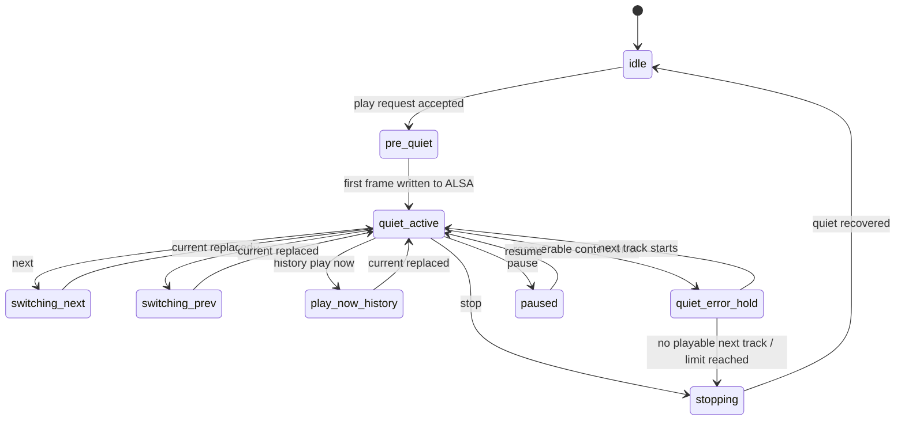
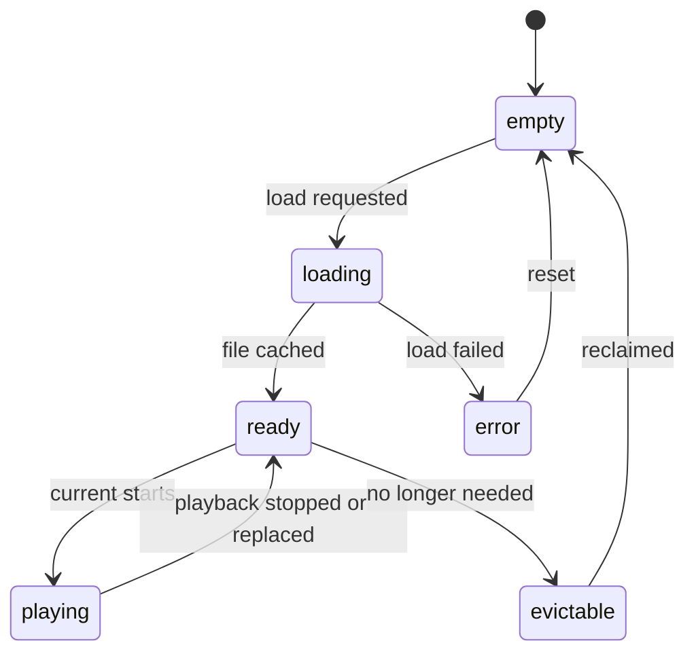

# V1 Local Mode 技术方案书

> Historical note: this technical proposal is archived for reference. The current active product and implementation direction should be read from [Product_Development_Manual.md](/Volumes/SeeDisk/Codex/Lumelo/docs/Product_Development_Manual.md) and [Development_Progress_Log.md](/Volumes/SeeDisk/Codex/Lumelo/docs/Development_Progress_Log.md).

## 1. 文档目的

本文件用于说明 `Lumelo V1 Local Mode` 的核心技术方案。

其中 `Lumelo` 是产品名，当前 `V1` 的硬件平台仍然是 `RK3399 / NanoPC-T4`。

它重点回答以下问题：

- 播放引擎如何封装
- 缓存状态机如何设计
- `Playback Quiet Mode` 如何切换
- 为什么选择当前数字音频输出路径
- 为什么不在 V1 采用 PipeWire、JACK 等方案

本文件是对产品说明书与 V1 规格文档的进一步技术收敛。

## 2. 本轮确认结论

### 2.1 点击播放后立即进入静默准备，并在第一帧后进入正式静默态

已确认：

- 用户点击播放后，系统立即进入 `pre-quiet`
- 当第一帧音频真正写入 ALSA 后，系统进入正式的 `Playback Quiet Mode`
- 不再保留一个“点击播放后仍处于管理态”的用户可见阶段

技术说明：

- 内部实现存在短暂的准备过程
- `play` 命令一经接受，系统立即进入静默准备态
- 真正的 `Quiet Mode active` 以音频开始输出为边界

### 2.2 V1 是纯数字播放器

已确认：

- V1 目标是尽量把干扰最少的数字信号送给 DAC
- V1 不引入软件混音
- V1 不引入 ReplayGain
- V1 不引入软件 EQ / DSP
- V1 不引入统一音频服务器混流层
- V1 不提供数字音量

边界说明：

- 如果媒体文件本身是 `FLAC`、`APE`、`MP3` 等格式，文件解码在工程上仍然存在
- 但系统目标仍然是：
  - 不做额外重采样
  - 不做软件音量
  - 不做混流
  - 不做音效处理
- 如果媒体文件本身是 `WAV`、`PCM`、`DSF`、`DFF` 等更直接的格式，播放路径会更简单

### 2.3 V1 继续以直连 ALSA 为首选输出路径

当前技术判断：

- 对 Linux 上的单机、单应用、单 DAC、本地数字播放场景，`直连 ALSA hw 路径` 仍是 V1 最适合的方案
- 没有发现一个在该场景下比 `ALSA 直连` 更低层、更简洁、且更主流可维护的替代路径

### 2.4 DSD 输出策略默认使用 Strict Native

已确认：

- V1 的默认 DSD 输出策略为 `Strict Native`
- 默认不自动启用 `DoP`
- 默认不允许 `DSD -> PCM` 自动回退

V1 需要提供一个兼容性选项：

- `Native + DoP`

该选项用于：

- 当 DAC 或驱动不支持 Native DSD 时
- 允许通过 DoP 继续进行 bit-perfect 方向的 DSD 输出

## 3. 技术取舍结论

## 3.1 为什么首选 ALSA 直连

根据 ALSA 官方文档：

- `hw` 插件是与内核 PCM 驱动直接通信的原始路径
- ALSA 支持直接缓冲区访问，也就是 `mmap` 方式

这意味着，对 V1 这种：

- 单播放器
- 单 DAC
- 不需要混流
- 不需要桌面音频
- 不需要多应用音频路由

的产品，最合适的原则是：

- 直接打开 `hw:` 设备
- 避免 `default` / `dmix`
- 避免额外音频服务器

参考：

- ALSA PCM 接口文档: [PCM Interface](https://www.alsa-project.org/alsa-doc/alsa-lib/pcm.html)
- ALSA `hw` 插件说明: [PCM plugins](https://www.alsa-project.org/alsa-doc/alsa-lib/pcm_plugins.html)
- ALSA 直接缓冲访问: [MMAP functions](https://www.alsa-project.org/alsa-doc/alsa-lib/group___p_c_m___direct.html)

## 3.2 为什么不优先选 PipeWire

根据 PipeWire 官方文档：

- PipeWire 是图模型的多媒体处理框架
- 它通过 `alsa-lib` 暴露 ALSA 设备

这说明：

- PipeWire 并不是比 ALSA 更低的一层
- 它是在 ALSA 之上增加了一层图、节点和会话管理

PipeWire 对这些场景很有价值：

- 桌面混音
- 多应用共享设备
- 图式路由
- 统一音视频管理

但这些都不是 V1 的目标。

对 V1 来说，PipeWire 的主要问题不是“音质一定差”，而是：

- 层次更厚
- 管理更复杂
- 行为更偏通用桌面
- 不符合“单播放器、单 DAC、静默运行”的产品哲学

参考：

- PipeWire Overview: [Overview](https://docs.pipewire.org/page_overview.html)
- PipeWire ALSA/Pulse 兼容层: [PulseAudio Compatibility](https://docs.pipewire.org/page_pulseaudio.html)

## 3.3 为什么不优先选 JACK

根据 JACK 官方资料：

- JACK 是面向专业音频和多应用同步连接的音频服务器
- JACK 默认也以 ALSA 作为 Linux 上的音频 I/O 驱动

JACK 很强，适合：

- 专业音频
- 低延迟图式连接
- 多客户端严格同步

但 V1 不是工作站，也不是路由台。

对 V1 来说，JACK 的问题在于：

- 额外引入一个音频服务器
- 更适合多应用路由而不是单一播放器
- 比直连 ALSA 更复杂

JACK 官方 FAQ 也指出，虽然 JACK 不额外增加延迟，但会增加一点 CPU 工作量；同时，很多资深用户会选择不与 PulseAudio 混用。

参考：

- JACK 首页: [JACK Audio Connection Kit](https://jackaudio.org/)
- JACK FAQ: [Does using JACK add latency?](https://jackaudio.org/faq/no_extra_latency.html)
- JACK FAQ: [Realtime scheduling vs RT kernel](https://jackaudio.org/faq/realtime_vs_realtime_kernel.html)
- JACK FAQ: [PulseAudio and JACK](https://jackaudio.org/faq/pulseaudio_and_jack.html)

## 3.4 对本项目的最终建议

V1 推荐音频输出路径：

`playbackd -> ALSA hw device -> DAC`

并遵循：

- 不经过 PipeWire
- 不经过 PulseAudio
- 不经过 JACK
- 不使用 dmix
- 不使用软件混音
- 不使用软件音量
- 不使用 ReplayGain
- 不强制重采样
- 不默认把 DSD 转为 PCM

如果使用 MPD 的 ALSA 输出，官方文档同样建议使用 `hw` 设备，并关闭软件混音等影响 bit-perfect 的配置。

参考：

- MPD 用户手册: [User’s Manual](https://mpd.readthedocs.io/en/stable/user.html)
- MPD 插件参考: [Output plugins](https://mpd.readthedocs.io/en/stable/plugins.html)

## 3.5 Transport Output Policy

V1 的输出策略按媒体类型划分如下。

### PCM 类文件

例如：

- `WAV`
- `FLAC`
- `APE`
- `AIFF`

规则：

- `FLAC` 等无损压缩格式需要先解码还原为 PCM
- 解码后的 PCM 原样送往 `ALSA hw`
- 不重采样
- 不软件音量
- 不混音
- 不做额外处理

说明：

- `FLAC` 本身不是 DAC 直接接收的总线格式
- 对 `FLAC -> PCM` 的无损还原仍然属于 bit-perfect 路线

### DSD 类文件

例如：

- `DSF`
- `DFF`

V1 提供两个静态策略：

#### 1. Strict Native

这是默认策略。

规则：

- 仅允许 `Native DSD`
- 不启用 `DoP`
- 不允许 `DSD -> PCM` 自动回退
- 如果 DAC 或驱动不支持 Native DSD，则播放失败或无声

定位：

- 最纯粹的 transport 模式
- 以输出路径最短、行为最确定为优先

#### 2. Native + DoP

这是兼容性策略。

规则：

- 优先使用 `Native DSD`
- Native 不可用时允许 `DoP`
- 不允许 `DSD -> PCM` 自动回退

定位：

- 在保持 bit-perfect 方向的前提下提升兼容性

### 配置原则

V1 建议将该策略做成静态配置：

- 默认 `Strict Native`
- 用户可在设置中切换到 `Native + DoP`
- 保存后重启生效
- 运行时不进行自动策略切换

### 不建议的策略

V1 不建议也不默认提供：

- `DSD -> PCM` 自动兼容回退

原因：

- 不符合 transport 的纯粹定位
- 容易让用户误以为 DSD 仍在原样输出

## 4. 板级线与技术栈定案

## 4.1 板级线选择原则

对本项目而言，`rootfs` 的发行版名不是关键决策点。

真正关键的是：

- `kernel` 从哪条线来
- `dtb` 从哪条线来
- `u-boot / boot chain` 从哪条线来

因此，V1 采用以下架构原则：

- `rootfs` 与 `kernel / dtb / u-boot` 解耦
- `rootfs` 由项目自行定义
- `kernel / dtb / u-boot` 初期优先采用 FriendlyELEC 的稳定 T4 板级线

### 当前推荐方案

V1 当前采用方案 C：

- 自定义极简 `rootfs`
- 初期使用 FriendlyELEC 的 T4 稳定板级线
- 后续再评估是否迁移到更主线的 `kernel / dtb`

### 这样做的原因

- rootfs 可以持续按产品需求演进
- T4 的 USB、存储、启动链、板级设备支持可以优先借助稳定线
- 后续若需要切换更主线的 `kernel / dtb`，不必推翻整个产品系统

### 对开发流程的影响

这意味着后续开发应按两层推进：

1. 板级 bring-up
2. 上层 rootfs 与音频系统实现

而不是围绕某个完整镜像直接做“整包改造”。

## 4.2 技术栈最终选型

当前技术栈定案如下：

- `playbackd`：Rust
- `controld`：Go
- 前端：轻量服务端渲染页面，配少量原生 JS
- WebUI：`mobile-first`，V1 只保证手机版基本功能
- IPC：UDS + 简单文本行协议
- 静态配置：TOML
- 媒体库与索引：SQLite
- 历史记录：轻量 JSON
- 队列状态：轻量 JSON
- V1 不引入独立 `session.json`

### 4.2.1 playbackd 采用 Rust

选择 Rust 的核心原因不是“追新”，而是：

- `prev/current/next` 三曲窗口本质上是资源所有权问题
- `Play Now`、历史播放、随机顺序、延后回收都高度依赖状态一致性
- `Playback Quiet Mode` 下更需要内存与并发行为可预测

因此，V1 的播放核心优先采用 Rust，而不是 C。

### 4.2.2 controld 采用 Go

选择 Go 的原因：

- 编译为单二进制，便于部署到 `aarch64`
- WebUI / API / WebSocket 生态成熟
- goroutine 适合控制层并发
- GC 发生在控制层，不进入播放热路径

前端边界补充：

- V1 的 WebUI 先做 `mobile-first`
- V1 不单独设计桌面专用复杂布局
- V1 不以视觉美化、动画和大范围版面打磨为优先目标
- 后续版本可在不影响播放内核的前提下继续迭代版面表现

### 4.2.3 IPC 采用 UDS 文本行协议

V1 不使用 JSON 作为 `playbackd` 的控制协议。

建议的 IPC 形式：

- Unix Domain Socket
- 简单文本行协议

示例：

- `PLAY <id>\n`
- `PAUSE\n`
- `STOP\n`
- `NEXT\n`
- `PREV\n`
- `PLAY_HISTORY <id>\n`

这样做的原因：

- 解析开销低
- 调试直观
- 回放和抓包简单
- Quiet Mode 下行为更可预测

### 4.2.4 配置、媒体索引与运行时状态分离

V1 采用：

- `TOML` 保存静态配置
- `SQLite` 保存媒体库与索引
- 轻量 `JSON` 保存历史记录
- 轻量 `JSON` 保存队列状态

静态配置包括：

- 模式
- 网络接口模式
- DSD 输出策略
- WebUI 基础设置
- Quiet Mode 的非核心行为微调

推荐配置文件布局：

- `/etc/lumelo/config.toml`：当前生效配置
- `/usr/share/lumelo/default_config.toml`：只读默认配置

配置恢复规则：

1. 启动时优先读取 `/etc/lumelo/config.toml`
2. 如果解析失败：
   - 备份损坏配置
   - 用 `/usr/share/lumelo/default_config.toml` 恢复
   - 设置恢复标记
3. UI 启动后向用户发出明确告警

媒体库与索引包括：

- 媒体索引
- 目录树缓存
- 惰性解析得到的曲目元数据

轻量运行时状态包括：

- 播放历史
- 队列状态

### 4.2.4.1 V1 采用极简恢复策略

V1 的跨重启恢复按“极简 / 纯净 / 最少干扰”原则收敛。

已确认：

- V1 不做跨重启进度恢复
- V1 不做 `elapsed_ms` 的周期性写盘
- V1 不引入独立 `session.json`
- V1 不持久化 `prev / current / next` 的 RAM 内容
- V1 不持久化 Quiet Mode 状态

V1 需要持久化的运行时数据仅包括：

- `queue.json`：队列、当前指针、顺序模式、重复模式与随机顺序相关状态
- `history.json`：最近播放历史
- `library.db`：媒体索引与目录缓存

恢复规则：

1. 由 `playbackd` 自行读取并恢复运行时状态
2. `controld` 不直接读取持久化文件后反向指挥 `playbackd`
3. 重启后仅恢复：
   - 队列内容
   - 当前曲目指针
   - `order_mode`
   - `repeat_mode`
   - 随机顺序相关状态
4. 系统启动后统一进入 `stopped`
5. 不自动恢复播放，不自动恢复暂停点

说明：

- V1 默认是 `Pure Mode`，没有进度条，也不支持 seek
- 在该前提下，跨重启秒级进度恢复会增加写盘、状态复杂度和恢复逻辑负担
- 因此这部分能力推迟到未来 `Convenience Mode` 再讨论

### 4.2.4.2 `queue.json` 作为唯一恢复入口

V1 的队列恢复以 `queue.json` 为唯一入口。

推荐字段边界如下：

- `version`
- `updated_at`
- `order_mode`
- `repeat_mode`
- `current_order_index`
- `play_order`
- `tracks`

字段说明：

- `version`
  - 队列文件 schema 版本
- `updated_at`
  - 文件级更新时间
- `order_mode`
  - 当前顺序模式
  - V1 支持：
    - `sequential`
    - `shuffle`
- `repeat_mode`
  - 当前重复模式
  - V1 支持：
    - `off`
    - `one`
    - `all`
- `current_order_index`
  - 当前播放位置在 `play_order` 中的下标
- `play_order`
  - 当前实际播放顺序
  - 由 `queue_entry_id` 组成
  - `order_mode=sequential` 时按当前队列顺序保存
  - `order_mode=shuffle` 时直接保存当前伪随机后的结果
  - `order_mode=shuffle` 且 `repeat_mode=all` 时，重复同一份 `play_order`
- `tracks`
  - 当前播放队列
  - 建议每项至少保存：
    - `queue_entry_id`
    - `track_uid`
    - `volume_uuid`
    - `relative_path`
  - 可选保留少量显示缓存：
    - `title`
    - `duration_ms`

说明：

- V1 直接持久化 `play_order`，而不是只持久化随机种子
- 这样重启后可恢复同一播放顺序，不依赖算法实现细节
- `order_mode=shuffle` 时，手动调序能力默认禁用
- 如需手动调整队列顺序，用户应先切回 `order_mode=sequential`
- 当前曲目可由 `play_order[current_order_index]` 推导得到
- 因此不需要单独持久化 `current_track_uid`

### 4.2.4.3 被移除的 session 字段去向

V1 不再保留独立 `session.json` 后，原先会话字段的处理方式如下：

- `version`
  - 保留
  - 作为 `queue.json` / `history.json` 的文件级 schema 版本
- `state`
  - 不再持久化
  - 仅作为 `playbackd` 运行时内存状态存在
- `current_track_uid`
  - 不再单独持久化
  - 由 `queue.json` 中的 `play_order + current_order_index` 推导
- `elapsed_ms`
  - V1 移除
  - 不做周期写盘，不做跨重启恢复
- `saved_at`
  - 不再作为会话字段存在
  - 如有需要，仅保留为文件级 `updated_at`

### 4.2.5 媒体模型采用“双视图 + 增强索引”

V1 的本地媒体模型采用以下原则：

- 本地媒体页采用双视图：
  - 默认 `专辑` 视图
  - 保留 `文件夹` 视图
- 插盘后不自动触发全量扫库
- 播放时彻底禁止任何扫描活动
- 插盘时先完成设备识别、挂载和浅层目录建立
- 文件夹视图中的目录内容按需展开
- 全量扫库通过单独按钮手动触发
- 新介质尚未建索引时：
  - 专辑视图显示空态提示
  - 提供“一键扫描”
  - 允许切换到文件夹视图继续浏览

### 4.2.6 元数据与封面策略

V1 对元数据、搜索和封面采用“增强索引 + 资源分离”策略：

- `library.db` 可以支持较强的曲库索引能力，以适配几十 GB、数百到上千专辑的本地曲库
- 播放核心不依赖这些增强索引才能继续播放当前队列
- 扫库、全文索引、封面提取、缩略图生成只能发生在：
  - 手动扫库
  - 明确允许的空闲期
  - 非播放态

专辑聚合规则：

- 主视图以 `album artist` 作为专辑聚合主键的一部分
- `ARTIST` 作为辅助字段：
  - 用于详情展示
  - 用于搜索匹配
  - 不作为专辑聚合主键
- 聚合策略采用“保守合并”原则
  - 宁可把不同目录下的同名专辑分成两张
  - 也不应把两个不同版本误合并成一张

### 4.2.6.1 专辑聚合键与标准化规则

V1 的 `album_uid` 建议按以下方式生成：

`hash(volume_uuid + normalized_album_artist + normalized_album_title + album_root_dir_hint)`

标准化规则建议固定为：

1. Unicode `NFC` 标准化
2. 转小写
3. 去掉首尾空格
4. 合并连续空格为单个空格
5. 去掉常见标点：
   - `.`
   - `,`
   - `'`
   - `"`
   - `!`
   - `?`

明确不做：

- 不去掉括号内容
- 不做音译
- 不做截断

说明：

- `Wish You Were Here (Remastered)` 这类标题应保留括号内容参与聚合
- 中文、日文等原始文本保持原样参与标准化
- 建议哈希算法采用 `SHA1`，并截取前 `16` 位作为 `album_uid`

### 4.2.6.2 `album_root_dir_hint` 与多碟提升规则

`album_root_dir_hint` 的作用是：

- 避免同专辑不同目录被激进合并
- 让标准多碟目录结构在专辑视图中保持合并

建议匹配以下目录名模式以触发提升到父目录：

- `CD[0-9]+`
- `Disc[0-9]+`
- `Disk[0-9]+`
- `DISC[0-9]+`
- `碟[0-9]+`
- 纯数字子目录
  - 仅在同级存在多个纯数字兄弟目录时触发

示例：

- `/media/usb/Pink Floyd - The Wall/CD1/` 提升为 `/media/usb/Pink Floyd - The Wall/`
- `/media/usb/Pink Floyd - The Wall/CD2/` 提升为 `/media/usb/Pink Floyd - The Wall/`

不触发提升的情况：

- 只有一个子目录
- 目录名不匹配以上模式

### 4.2.6.3 `source_mode` 与目录回退聚合

V1 的专辑聚合建议保留 `source_mode` 字段，用于标识专辑的聚合来源。

`source_mode=tag`：

- `ALBUMARTIST` 有值时，使用 `ALBUMARTIST`
- `ALBUMARTIST` 为空时，回退到 `ARTIST`
- 若两者都为空，再进入目录回退模式

`source_mode=directory_fallback`：

- `album_artist` 固定为 `Unknown Artist`
- `album_title` 取 `album_root_dir_hint` 的最后一级目录名
- 仍按统一规则生成 `album_uid`

UI 建议：

- `source_mode=directory_fallback` 的专辑可显示“目录聚合”提示
- 用于提醒用户该专辑的 tag 可能不完整

搜索规则：

- 建议采用 SQLite FTS5
- 搜索匹配至少包括：
  - 曲名
  - 专辑名
  - `album artist`
  - `ARTIST`
  - 文件名
  - 目录名 / `relative_path`

流派规则：

- 允许一首曲目拥有多个 `genre`
- 采用多对多关系，不压扁成单值字段

封面与缩略图规则：

- 主 `library.db` 不存封面 blob
- 主 `library.db` 不存缩略图 blob
- `library.db` 只存封面/缩略图引用与元数据
- 实际图片资源放在文件缓存目录
- 封面优先查找同级目录中的 `folder.jpg` / `cover.jpg`
- 仅在必要时解析内嵌封面

媒体标识建议：

- 不依赖瞬时挂载路径
- 优先使用 `volume_uuid + relative_path`

这样可以在 USB / TF 重新挂载后保持更稳定的媒体定位能力。

### 4.2.6.4 `library.db` 建议表结构

为了兼顾大曲库与后续扩展，`library.db` 建议至少包含以下表：

- `volumes`
- `directories`
- `albums`
- `tracks`
- `artists`
- `genres`
- `album_artists`
- `track_artists`
- `track_genres`
- `artwork_refs`
- `search_fts`

用途说明：

- `volumes`
  - 记录 TF / USB 设备
- `directories`
  - 支撑文件夹视图
- `albums`
  - 支撑默认专辑封面平铺视图
- `tracks`
  - 记录可播放曲目与基本格式信息
- `artists`
  - 供详情展示和搜索使用
- `genres`
  - 支撑多流派关系
- `album_artists`
  - 明确专辑聚合主艺人
- `track_artists`
  - 记录曲目参与艺人
- `track_genres`
  - 记录曲目多流派映射
- `artwork_refs`
  - 只存图片引用、哈希与尺寸，不存 blob
- `search_fts`
  - 支撑全文搜索

建议的 `albums` 关键字段：

- `album_id`
- `album_uid`
- `volume_uuid`
- `album_title`
- `album_title_norm`
- `album_artist`
- `album_artist_norm`
- `album_root_dir_hint`
- `year`
- `disc_count`
- `track_count`
- `total_duration_ms`
- `cover_ref_id`
- `musicbrainz_release_id`
- `source_mode`
- `indexed_at`

建议的 `tracks` 关键字段：

- `track_uid`
- `album_id`
- `volume_uuid`
- `relative_path`
- `filename`
- `title`
- `artist`
- `album_artist`
- `track_no`
- `disc_no`
- `duration_ms`
- `sample_rate`
- `bit_depth`
- `format`
- `cover_ref_id`
- `musicbrainz_track_id`
- `file_mtime`
- `indexed_at`

字段说明：

- `disc_no`
  - 仅用于专辑详情页排序，不进入聚合键
- `total_duration_ms`
  - 供专辑详情页直接显示总时长
  - 避免 WebUI 每次动态聚合计算
- `indexed_at`
  - 记录最近一次索引时间
  - 为后续增量扫描预留边界
- `file_mtime`
  - 供后续增量扫描判断单曲文件是否变化
- `musicbrainz_release_id` / `musicbrainz_track_id`
  - 仅作辅助字段
  - 不参与专辑聚合键

### 4.2.6.5 专辑详情页排序规则

建议排序规则：

- 默认：
  - `ORDER BY disc_no ASC, track_no ASC`

显示规则：

- `disc_count=1` 或所有曲目 `disc_no=1` 时
  - 不显示 `Disc` 分组标题
- 存在多个 `disc_no` 时
  - 按 `Disc 1`、`Disc 2` 分组展示

缺失 `track_no` 的曲目：

- 排在有序号曲目之后
- 同组内再按文件名排序

### 4.2.6.6 资源缓存层

图片相关资源建议放在独立缓存层，而不是主索引库。

建议：

- `library.db` 只存引用与元数据
- 原始封面文件与缩略图文件放在单独缓存目录
- 如未来确有必要引入 blob，也应单独放在独立资源库，不与主 `library.db` 混用

V1 建议目录结构：

- `/var/cache/lumelo/artwork/source/<ab>/<cd>/<cover_ref_id>.<ext>`
- `/var/cache/lumelo/artwork/thumb/320/<ab>/<cd>/<cover_ref_id>.jpg`
- `/var/cache/lumelo/artwork/tmp/`

分桶规则建议：

- 使用 `cover_ref_id` 前 `4` 个字符
- 前 `2` 个字符作为一级目录
- 第 `3-4` 个字符作为二级目录

示例：

- `cover_ref_id = a1b2c3d4e5f6...`
- `source/a1/b2/a1b2c3d4e5f6....<ext>`
- `thumb/320/a1/b2/a1b2c3d4e5f6....jpg`

`cover_ref_id` 建议按以下方式生成：

`hash(source_kind + volume_uuid + source_relative_path + source_mtime_sec + source_size + embed_index + cache_version)`

字段约束建议：

- `source_mtime_sec`
  - 使用秒级 Unix 时间戳
  - 不要求毫秒精度
- `source_size`
  - 使用字节数
  - 与 `mtime` 联合判断变化
- `cache_version`
  - 使用整数
  - V1 当前建议值为 `1`

说明：

- 图片缓存不是内容真相源，而是可重建派生物
- 不必对源图片做额外内容哈希
- `mtime + size + cache_version` 足以作为 V1 的缓存失效依据

建议的 `artwork_refs` 关键字段：

- `cover_ref_id`
- `source_kind`
- `source_volume_uuid`
- `source_relative_path`
- `source_mtime`
- `source_size`
- `embed_index`
- `mime`
- `width`
- `height`
- `cache_version`
- `thumb_320_ready`
- `created_at`

字段说明：

- `thumb_320_ready`
  - 作为缩略图是否已生成的提示位
  - 即使值为 `1`，若缓存文件缺失，UI 仍应回退到占位图
  - 后续在非播放态再补生成
  - 允许先写入 `artwork_refs`，再异步补齐 `thumb/320`

V1 的缩略图策略建议固定为：

- 只保留一档缩略图：`320px`
- 输出格式先使用 `JPEG`
- 专辑平铺页优先读取 `thumb/320`
- 无缓存时显示占位图

生成时机：

- 手动全量扫库
- 明确允许的空闲期
- 用户进入专辑页且当前不在播放

明确禁止：

- 播放时提取封面
- 播放时生成缩略图
- 播放时补齐图片缓存
- 播放时执行图片缓存清理

离线显示策略：

- 介质离线后仍可显示已缓存封面
- 专辑卡片应标记 `offline=true`
- UI 可显示灰色遮罩或“介质离线”角标
- 点击离线专辑时，应提示“介质已离线，无法播放”
- 不要求从专辑列表中隐藏该项

离线状态判断建议：

- 不额外引入每卷运行时状态文件
- `controld` 在返回专辑列表时，根据当前已挂载的 `volume_uuid` 集合直接标记 `offline`
- 如后续确需引入运行时状态文件，也应放在 `/run/lumelo/...` 命名空间下

缓存清理建议：

- 启动时仅清理 `/var/cache/lumelo/artwork/tmp/`
- 不在启动时扫描 `source/` 或 `thumb/`
- 提供手动“清空图片缓存”入口

`orphan sweep` 建议触发条件：

- 手动扫库完成后
- 当前不在播放
- 系统空闲超过 `30` 秒

`orphan sweep` 规则：

- 以缓存文件系统为遍历起点
- 若缓存文件在 `artwork_refs` 中无对应记录，则视为孤儿缓存
- 批量删除孤儿缓存文件

V1 不要求：

- 访问时间 `LRU`
- 每次浏览都更新图片缓存元数据
- 常驻后台清理线程

### 4.2.6.7 历史记录持久化规则

V1 的历史记录采用轻量 JSON 持久化。

建议规则：

- 仅保存最近 `100` 首
- 只保存轻量元数据和稳定媒体标识
- 单写者原则：仅允许 `playbackd` 写入
- 采用原子写入：临时文件 + `fsync` + `rename`
- 文件中保留 `version` 与 `updated_at`

说明：

- 历史记录不参与预加载
- 历史记录不应在播放热路径高频写入
- 仅在曲目切换等事件点更新

### 4.2.7 线程模型采用“朴素优先”

这是 V1 的明确架构原则。

V1 的播放核心采用：

- 固定线程数量
- 固定线程职责
- `std::thread + std::sync::mpsc`

而不是 async runtime 驱动的线程模型。

### 4.2.8 不使用 Tokio

V1 不将 Tokio 作为 `playbackd` 的核心并发模型。

原因：

- async runtime 本身也是一个调度器
- Quiet Mode 追求的是“可预测”，而不是“任务自动调度得更聪明”
- runtime 的唤醒、轮询和任务调度会增加额外不确定性

对本项目来说，播放热路径越朴素越好。

### 4.2.9 推荐线程结构

#### audio_thread

职责：

- 专用音频输出线程
- 只负责向 ALSA 写数据，例如 `snd_pcm_writei`

规则：

- 不做其他工作
- 优先级最高
- 尽量独占指定 CPU 核心

#### state_machine_thread

职责：

- 管理 `prev/current/next`
- 管理队列、历史、随机顺序、静默态相关状态
- 响应 channel 消息

规则：

- 负责决策
- 不直接执行磁盘 I/O

#### loader_thread

职责：

- 从本地介质读取文件到 RAM
- 执行必要格式还原

示例：

- `FLAC -> PCM`
- `DSF -> DSD raw`

规则：

- 负责加载与预载
- 不参与控制决策

#### ipc_thread

职责：

- 监听 UDS
- 接收控制命令
- 将命令转发到内部 channel

规则：

- 只做收发
- 不做播放决策

### 4.2.10 线程模型结论

V1 的播放核心采用：

- `Rust`
- `std::thread`
- `std::sync::mpsc`
- 固定职责线程

而不是：

- C + 手动复杂并发
- Rust + Tokio 大规模 async runtime

这条原则的目的，是让：

- `audio_thread` 永远保持最朴素
- 播放热路径尽可能少受额外调度机制影响

### 4.2.11 设置生效规则

V1 将设置分成两类：

#### 立即生效

- WebUI 皮肤切换
- Quiet Mode 的非核心行为微调

#### 必须重启生效

- `Local / Bridge` 模式切换
- 网络接口模式切换
- DSD 输出策略切换

这样做的目的，是让系统行为更可预测，并降低运行时切换对播放路径的干扰。

### 4.2.12 V2 预留的播放交互模式开关

V2 预留一个播放交互模式设置项：

- `Pure Mode`
- `Convenience Mode`

判断：

- 该开关属于控制层 / UI 层行为策略
- 不属于板级模式、网络模式或输出策略切换
- 预计立即生效，不需要重启

规则：

- 默认始终为 `Pure Mode`
- `Pure Mode` 不显示进度条，不支持 seek
- `Convenience Mode` 才允许进度条与后续 seek 能力
- 该开关不改变 ALSA 路径、DSD 输出策略或 RAM Window 基本策略

## 4.3 V1 播放引擎封装建议

## 4.3.1 模块分工

V1 建议拆成以下逻辑模块：

- `playbackd`
- `sessiond`
- `controld`
- `media-indexd`

### 4.3.1.1 服务形态判断

这 4 个模块在逻辑上独立，但运行形态不应完全等同。

建议如下：

- `playbackd`
  - 单独进程
  - 长期常驻
  - 核心状态权威
- `sessiond`
  - 单独进程
  - 长期常驻
  - 薄服务，只维护 Quiet Mode 与系统环境切换
- `controld`
  - 单独进程
  - 长期常驻
  - 薄控制层，只负责 WebUI / API
- `media-indexd`
  - 逻辑上独立
  - 进程上独立
  - 运行上按需启动
  - 更接近 `worker service`，不建议做成长期高活跃常驻服务

说明：

- `playbackd`、`sessiond`、`controld` 都应保持职责明确的长期服务形态
- `media-indexd` 应尽量只在需要索引、重扫或更新目录缓存时运行
- 这样更符合“极简 / 纯净 / 最少干扰”的系统原则

### playbackd

职责：

- 播放状态机
- 队列管理
- `play_order` 管理
- 随机顺序管理
- `history_log` 管理
- `ram_window` 管理
- `queue.json` / `history.json` 写入
- 发起 ALSA 播放
- 响应 `play/pause/stop/prev/next/play-now`

不负责：

- WebUI / API
- Quiet Mode 的系统环境切换
- 媒体扫描
- 设置页逻辑
- 非播放期后台管理任务

### sessiond

职责：

- 订阅 `playbackd` 事件
- 维护 `Playback Quiet Mode` 状态
- 通知各服务进入静默态或恢复态
- 维持播放期的服务域策略
- 维护 `/run/audio/quiet_mode`
- 通知 `controld` quiet 状态变化

不负责：

- 干预 `playbackd` 内部逻辑
- 音频线程优先级调整
- RAM Window 管理
- 队列与播放决策

说明：

- `sessiond` 应保持独立于 Web 层
- Quiet Mode 的切换不应依赖 `controld` 是否正常
- 这样播放期的系统静默行为才更可预测

### controld

职责：

- 提供 WebUI / API
- 将用户命令转发给 `playbackd`
- 低频展示状态
- 提供设置页
- 写入 `config.toml`
- 管理需要重启生效的设置保存流程

不负责：

- 自行维护队列真相
- 自行重建 `shuffle` 顺序
- 自行更新播放指针
- 自行决定 `Play Now` 后的队列状态
- 自行写入 `queue.json`
- 自行决定 Quiet Mode 切换

### media-indexd

职责：

- 管理 TF 卡 / USB 存储索引
- 空闲期进行媒体重扫
- 播放期停止主动扫描
- 维护 `library.db`
- 负责目录树缓存与惰性元数据更新

不负责：

- 播放
- 队列
- 历史
- Web 状态
- Quiet Mode 决策

运行建议：

- 优先做成按需启动的独立 worker
- 只在以下场景运行：
  - 手动全量扫库
  - 目录缓存更新
  - 惰性元数据补全
- 播放期间不应主动工作

## 4.3.2 状态权威

V1 中应由 `playbackd` 作为播放状态的唯一权威。

即：

- 队列状态以 `playbackd` 为准
- 当前播放曲目以 `playbackd` 为准
- 随机顺序以 `playbackd` 为准
- `prev/current/next` 以 `playbackd` 为准

WebUI 不直接操作底层输出，只发送命令并读取状态。

### 4.3.2.0 服务耦合原则

建议的最小耦合关系如下：

- `controld -> playbackd`
  - 发送控制命令
- `playbackd -> sessiond`
  - 广播播放事件
- `playbackd -> controld`
  - 返回状态或广播状态变化
- `sessiond -> controld`
  - 通知 quiet 状态变化
- `media-indexd`
  - 尽量少与其他服务直连
  - 主要通过 `library.db` 与控制层共享索引结果

原则：

- 不让 `media-indexd` 感知 `playbackd` 的内部状态
- 不让 `controld` 成为 Quiet Mode 的决定者
- 不让多个服务同时持有播放状态真相

### 4.3.2.1 队列逻辑边界

V1 中与队列相关的所有核心逻辑均由 `playbackd` 负责。

包括：

- 顺序播放下的 `play_order` 维护
- `shuffle` 顺序生成与重建
- `current_order_index` 更新
- `Play Now` 打断后的当前播放位更新
- 队列增删改后的顺序修复
- `order_mode` / `repeat_mode` 的最终解释

`controld` 只负责：

- 展示队列快照
- 接收用户输入
- 将命令转发给 `playbackd`

说明：

- `controld` 可以管理“队列页面”
- 但不管理“队列逻辑”
- 这样可以避免 `controld` 与 `playbackd` 出现双重真相来源

### 4.3.2.2 队列项标识建议

为了避免同一首歌多次加入队列时发生状态混淆，V1 建议区分：

- `track_uid`
- `queue_entry_id`

其中：

- `track_uid`
  - 标识底层媒体文件
- `queue_entry_id`
  - 标识该媒体文件在当前队列中的一次具体出现

建议：

- `tracks` 中保存 `queue_entry`
- 每个 `queue_entry` 指向一个 `track_uid`
- `play_order` 指向 `queue_entry_id`
- `current_order_index` 指向 `play_order` 中的位置

这样可以保证：

- 同一首歌重复加入队列时仍可稳定排序
- 删除、移动、`Play Now` 与 `shuffle` 重建时不混淆队列项

### 4.3.2.3 播放模式建模

V1 不再使用单一播放模式字段，而是拆分为：

- `order_mode`
- `repeat_mode`

其中：

- `order_mode`
  - `sequential`
  - `shuffle`
- `repeat_mode`
  - `off`
  - `one`
  - `all`

规则如下：

- `order_mode=shuffle` 时，系统维护一份显式 `play_order`
- 队列未变化时，`play_order` 保持稳定
- `order_mode=shuffle` 且 `repeat_mode=all` 时，重复同一份 `play_order`
- 只有队列增删或用户关闭再重新开启 `shuffle` 时，才重建随机顺序
- 手动调序只在 `order_mode=sequential` 下允许
- `order_mode=shuffle` 下允许删除、清空与 `Play Now`，但不允许拖拽改顺序

## 4.3.3 systemd 编排与启动顺序

V1 的 systemd 编排遵循“先保证播放核心，再挂控制层”的原则。

### 4.3.3.1 目标划分

建议保留：

- `local-mode.target`
- `bridge-mode.target`

其中：

- `local-mode.target` 是 V1 的主目标
- `bridge-mode.target` 在 V1 仅作占位
- `playback-quiet` 不强制做成独立 target，可由 `sessiond` 通过状态切换实现

### 4.3.3.2 启动顺序建议

V1 的建议启动顺序如下：

1. 基础系统、`local-fs.target`、必要设备与挂载
2. `auth-recovery.service`
3. 当前启用接口所需的基础网络服务
4. `playbackd`
5. `sessiond`
6. `controld`
7. `media-indexd` 按需启动，不随常规开机自动拉起

补充原则：

- `auth-recovery.service` 只负责一次性检查物理恢复介质与认证重置标记
- `auth-recovery.service` 应在 `controld` 启动前完成
- `playbackd` 不应等待网络就绪
- `controld` 可以依赖当前启用接口的网络基础服务
- `sessiond` 依赖 `playbackd`，但不依赖 `controld`
- `media-indexd` 默认不 `WantedBy=multi-user.target`

### 4.3.3.3 失败隔离原则

- `controld` 崩溃不应影响 `playbackd`
- `sessiond` 崩溃不应阻塞 `playbackd`
- `media-indexd` 崩溃不应影响当前播放
- `playbackd` 属于核心故障，可由 systemd 重启，但应设置保守的重启限流，避免重启风暴

## 4.3.4 升级与维护模型

V1 的升级与维护优先追求可预测和低干扰。

已确认：

- V1 不做在线自动更新
- V1 不启用后台自动检查更新
- V1 优先采用手动升级包或手动刷写的维护路径

数据保留原则：

- 升级时优先保留：
  - `/etc/lumelo/config.toml`
  - `/var/lib/lumelo/queue.json`
  - `/var/lib/lumelo/history.json`
  - `/var/lib/lumelo/library.db`
- 不要求保留 RAM 运行态

回滚原则：

- 升级失败时，优先回到上一个可启动系统
- V1 可以先将此作为设计原则，不强制实现完整 A/B 升级机制

索引迁移原则：

- `library.db` 如遇 schema 不兼容，可直接重建
- 不为了保住旧索引而引入过于复杂的迁移链

## 4.3.5 安全和权限边界

V1 的安全边界采用“局域网 appliance + 基础认证 + 最小开放面”的策略。

已确认：

- WebUI 面向局域网使用，不以公网暴露为目标
- V1 提供基础登录能力
- V1 采用单管理员密码模型，不引入用户名
- V1 不做多用户和复杂角色系统
- 播放控制与系统设置接口应在逻辑上分层
- 写操作必须经过认证会话
- V1 首次启动必须先设置管理密码，不提供跳过入口
- 首次设置完成前，不进入正常首页
- 认证逻辑只位于 `controld`，不进入 `playbackd` / `sessiond`

登录模型建议：

- 登录页仅提供密码输入框
- 不提供用户名输入框
- 后端内部可固定为单一管理员身份
- 整个 WebUI 在 V1 中统一要求登录后访问

首次设置建议：

- 当系统尚未存在管理员密码哈希时，WebUI 直接进入“首次设置管理密码”页面
- 页面仅包含：
  - 新密码
  - 确认密码
- 设置成功后，立即创建认证会话并进入首页

密码与会话建议：

- 仅保存密码哈希，不保存明文
- 建议采用 `Argon2id`
- 最低长度要求可保持简洁，例如 `8` 位
- 使用 Cookie 会话
- 修改密码后，已有会话全部失效
- 会话失效后重新登录即可

恢复建议：

- V1 不做邮件找回或网页找回密码
- 建议采用物理侧恢复方式重置管理密码
- 密码重置后，系统重新进入首次设置状态

物理恢复交互建议：

1. 用户关机
2. 使用电脑准备一个 `FAT32` 的 TF 卡或 USB 恢复介质
3. 在介质根目录放置空文件：
   - `RESET_ADMIN_PASSWORD`
4. 插入设备并开机
5. 系统在 `controld` 启动前执行 `auth-recovery.service`
6. 若检测到该标记文件：
   - 清除管理员密码哈希
   - 清除所有认证会话
   - 强制关闭 SSH
   - 写入一次性 `auth_reset_pending` 标记
   - 删除或重命名 `RESET_ADMIN_PASSWORD`
7. WebUI 启动后直接进入“首次设置管理密码”页面

边界约束：

- 只在开机阶段检查一次，不监听运行时热插拔
- 只检查介质根目录，不递归扫描
- 只识别精确文件名 `RESET_ADMIN_PASSWORD`
- V1 仅要求支持 `FAT32` 恢复介质
- 若标记文件因文件系统限制无法删除，也应继续完成重置，并提示用户移除恢复介质，避免下次重复触发
- 密码重置后，系统保持 `stopped`，不自动恢复播放
- 网页内不提供“无旧密码重置”能力

SSH 规则：

- SSH 默认关闭
- 设置页中提供显式开启按钮
- 仅作为 PC 调试用途
- UI 中应明确显示 SSH 当前状态
- 开启 SSH 前，要求用户已处于认证状态
- 可进一步要求输入一次当前管理密码确认

## 5. 高层播放状态机

根据当前共识，V1 的高层播放状态机建议如下：



### 关键说明

- `play` 命令一旦被接受，立即进入 `pre_quiet`
- 第一帧音频真正写入 ALSA 后，才进入 `quiet_active`
- 不再保留用户可见的“播放前管理态”
- 任何切歌操作都在 `quiet_active` 内完成
- 队列连续播放期间，不应在曲目之间退出 `quiet_active`
- 可恢复的内容错误进入 `quiet_error_hold`
- `quiet_error_hold` 用于等待 `playbackd` 内部的一次性自动切歌，不用于长期错误恢复

## 6. RAM Window Playback 状态机

## 6.1 窗口定义

窗口固定为三个逻辑槽位：

- `prev`
- `current`
- `next`

## 6.2 槽位状态

每个槽位建议有以下状态：

- `empty`
- `loading`
- `ready`
- `playing`，仅 `current` 可用
- `evictable`
- `error`

## 6.3 槽位状态图



## 6.4 窗口维护规则

默认目标：

- 维持 `prev/current/next` 三曲窗口

优先级：

1. `current`
2. `next`
3. `prev`

内存不足时：

1. 先回收或降级 `prev`
2. 再回收或降级 `next`
3. 最后才允许影响 `current`

## 6.5 回收策略

已确认采用：

- `优先加载`
- `延后回收`

规则：

- 切歌时优先保证新 `current` 的加载和稳定播放
- 多余缓存先标记为 `evictable`
- 在新 `current` 已开始稳定播放后，再异步回收旧缓存
- 如果内存逼近安全阈值，则允许提前同步回收旧缓存

## 7. 历史播放与随机顺序

## 7.1 历史播放

V1 支持一个轻量历史播放记录：

- 至少保留最近 `100` 首
- 只保存轻量元数据
- 不保存音频缓存

点击历史曲目后的行为：

1. 当前播放立即中断
2. 原 `current` 变为新的 `prev`
3. 被点击曲目成为新的 `current`
4. 原 `next` 保持不变
5. 更旧缓存标记为 `evictable`

该行为定义为：

- `Play Now`
- 不要求重建整个队列

## 7.2 随机顺序

V1 中随机播放采用固定伪随机顺序。

建议维护：

- `play_order`
- `current_order_index`

V1 中随机顺序只在以下情况重建：

- 队列有增删
- 用户关闭并重新开启随机播放

当队列变化时：

- 当前曲目保持当前播放
- 已播部分顺序保持不变
- 从“下一首开始”的剩余部分重新生成随机顺序

说明：

- V1 以显式 `play_order` 作为实际播放顺序
- `controld` 不参与随机算法
- `playbackd` 在内存中重建顺序后，直接将结果落入 `queue.json`
- `order_mode=shuffle` 且 `repeat_mode=all` 时，重复当前 `play_order`

## 7.3 手动调序边界

V1 的手动调序能力遵循“顺序模式可控、随机模式可预测”的原则。

已确认：

- `order_mode=sequential` 时允许基础调序
- `order_mode=shuffle` 时不允许手动调序
- `order_mode=shuffle` 下仍允许：
  - 删除队列项
  - 清空队列
  - `Play Now`
- 如用户需要手动拖拽或上移 / 下移队列项，应先切换到 `order_mode=sequential`

## 8. Playback Quiet Mode 切换方案

## 8.1 设计原则

`Playback Quiet Mode` 是播放状态的一部分，不是事后补丁。

设计目标：

- 点击播放后立即进入静默准备态
- 在第一帧音频真正输出后进入正式静默态
- 连续播放期间维持静默态
- 停止播放后再退出静默态

### 8.1.1 sessiond 与 playbackd 的关系

V1 采用单向依赖：

- `playbackd` 只负责发出播放事件
- `sessiond` 只负责订阅事件并对系统采取动作

规则：

- `playbackd` 不知道 `sessiond` 是否存在
- `playbackd` 不等待 `sessiond` 的任何响应
- `sessiond` 只消费事件，不反向参与播放决策

这条设计的核心目标是：

- `playbackd` 的热路径上不能有任何等待 `sessiond` 响应的逻辑

### 8.1.2 事件传递方式

`playbackd` 通过单独的 UDS 事件 socket 对外广播事件。

实现原则：

- `playbackd` 维护订阅连接列表
- `sessiond` 启动后主动连接并订阅
- 事件采用 fire-and-forget 模式
- 对慢订阅者不做反压，直接断开连接

这样可以保证：

- 任何订阅者异常都不会污染播放热路径

### 8.1.3 事件集合

V1 的事件集合如下：

- `PLAY_REQUEST_ACCEPTED`
- `PLAYBACK_STARTED`
- `PLAYBACK_PAUSED`
- `PLAYBACK_RESUMED`
- `PLAYBACK_STOPPED`
- `TRACK_CHANGED`
- `PLAYBACK_FAILED`

关键边界：

- `PLAY_REQUEST_ACCEPTED`：用户播放请求已被接受，系统进入 `pre-quiet`
- `PLAYBACK_STARTED`：第一帧音频真正写入 ALSA，系统进入正式 Quiet Mode
- `PLAYBACK_PAUSED`：用户暂停
- `PLAYBACK_RESUMED`：从暂停恢复并重新开始输出
- `PLAYBACK_STOPPED`：播放完全停止
- `TRACK_CHANGED`：曲目切换，但播放态仍持续
- `PLAYBACK_FAILED`：播放启动或输出失败

建议协议格式：

- `EVENT PLAY_REQUEST_ACCEPTED track_id=xxx`
- `EVENT PLAYBACK_STARTED track_id=xxx format=FLAC rate=44100`
- `EVENT PLAYBACK_PAUSED`
- `EVENT PLAYBACK_RESUMED`
- `EVENT PLAYBACK_STOPPED reason=user_stop`
- `EVENT TRACK_CHANGED track_id=xxx`
- `EVENT PLAYBACK_FAILED reason=alsa_open_failed class=output recoverable=false keep_quiet=false`
- `EVENT PLAYBACK_FAILED reason=file_unreadable class=content recoverable=true keep_quiet=true auto_next_ms=6000`

## 8.2 服务域

建议将服务划分为：

- `core domain`
- `control domain`
- `media-work domain`
- `connectivity domain`

### core domain

播放期间必须保留：

- `playbackd`
- 必要 ALSA / 设备访问
- 必要系统服务

### control domain

播放期间保留，但进入低活动模式：

- WebUI
- API
- 状态查询

要求：

- 不做高频进度轮询
- 不做高频刷新
- 只响应命令和必要事件

### media-work domain

播放期间应冻结：

- 媒体重扫
- 缩略图和封面处理
- 非关键索引任务

### connectivity domain

播放期间仅保留当前已启用的那个接口域：

- Ethernet 或
- Wi-Fi

其他接口不应加载。

## 8.3 切换时序

### 进入静默态

当 `PLAY_REQUEST_ACCEPTED` 发出时：

1. `sessiond` 进入 `pre-quiet`
2. 停止启动新的扫描任务
3. `controld` 切入低活跃准备态

### 进入正式静默态

当 `PLAYBACK_STARTED` 发出时：

1. `sessiond` 立即进入 `quiet_active`
2. 冻结 `media-work domain`
3. 写入 `/run/audio/quiet_mode`
4. 通知 `controld` 进入 `QUIET_MODE ON`
5. `control domain` 切为低刷新

### 暂停

当 `PLAYBACK_PAUSED` 发出时：

1. `sessiond` 退出 `quiet_active`
2. 解冻 `media-work domain`
3. 删除 `/run/audio/quiet_mode`
4. 通知 `controld` 恢复正常推送频率
5. 允许 `playbackd` 保留 RAM Window

### 恢复

当 `PLAYBACK_RESUMED` 发出时：

1. `sessiond` 重新进入 `quiet_active`
2. 冻结 `media-work domain`
3. 写入 `/run/audio/quiet_mode`
4. 通知 `controld` 进入 `QUIET_MODE ON`

### 保持静默态

当队列连续播放或 `TRACK_CHANGED` 发出时：

- `sessiond` 不改变 Quiet Mode 状态
- 只要系统仍处于播放态，就保持静默

### 停止

当 `PLAYBACK_STOPPED` 发出时：

1. `sessiond` 退出 `quiet_active`
2. 解冻 `media-work domain`
3. `control domain` 切为低刷新
4. 删除 `/run/audio/quiet_mode`
5. 通知 `controld` 恢复正常推送频率

### 失败

当 `PLAYBACK_FAILED` 发出时：

1. `sessiond` 根据事件标志判断恢复路径
2. 若 `keep_quiet=false`：
   - 退出 `quiet_active`
   - 清理 `quiet_mode` 标志
   - 恢复被冻结服务
3. 若 `keep_quiet=true`：
   - 进入 `quiet_error_hold`
   - 保持 `media-work domain` 继续冻结
   - 不恢复正常扫描活动
4. 通知 `controld` 显示错误状态

### 8.3.1 sessiond 与 controld 的协议

`sessiond` 使用简单 UDS 指令通知 `controld`：

- `QUIET_MODE PREPARE`
- `QUIET_MODE ON`
- `QUIET_MODE OFF`

`controld` 收到：

- `QUIET_MODE PREPARE`：降低主动推送频率
- `QUIET_MODE ON`：停止主动推送进度，仅保留指令响应
- `QUIET_MODE OFF`：恢复正常推送频率

### 8.3.2 错误处理与恢复策略

V1 的错误处理遵循以下原则：

- 播放链错误优先 `fail-stop`
- 不做隐式输出路径回退
- 非播放链错误优先降级功能，不打断当前播放
- 不做高频自动重试
- 出错后的系统状态必须可预测

#### A. 输出链错误

包括：

- DAC 不可用
- DAC 被拔掉
- ALSA 打开失败
- `Strict Native` 下 Native DSD 不支持
- 明确无法继续向输出设备写入音频

处理规则：

1. `playbackd` 立即停止当前输出
2. 发出 `PLAYBACK_FAILED reason=... recoverable=false`
3. `sessiond` 退出 Quiet Mode
4. `controld` 明确提示错误原因
5. 不自动切到 `DoP`
6. 不自动切到 PCM
7. 不自动切下一首

#### B. 内容与介质访问错误

包括：

- 当前文件损坏
- 当前文件读不到
- 当前曲目在装载或解码前就确认不可播放

处理规则：

1. `playbackd` 发出 `PLAYBACK_FAILED reason=file_unreadable class=content recoverable=true keep_quiet=true auto_next_ms=6000`
2. `controld` 明确提示错误原因
3. UI 需要显示：
   - 错误原因
   - “6 秒之后切换到下一首”
4. UI 不要求可视化倒计时刷新
5. 自动切歌计时由 `playbackd` 内部维护
6. `controld` 只负责展示静态提示，不负责驱动补救逻辑
7. `sessiond` 进入 `quiet_error_hold`，保持系统继续处于静默错误保持态
8. 6 秒结束后，`playbackd` 自动切到“下一首可播放曲目”
9. 若不存在下一首可播放曲目，则进入 `stopped`

补充规则：

- 该 6 秒等待属于一次性错误流程，不应演变为新的常驻监听机制
- 任一用户显式操作都应取消该次自动切歌倒计时
- 连续内容错误自动切歌上限为 `3` 首，超过后进入 `stopped`
- 失败队列项可在当前运行期内标记为暂不可自动重试，避免重复失败循环

#### C. 当前运行期失败项临时标记

V1 对内容错误采用“本次运行期临时失败标记”。

建议规则：

- 该标记只存在于 `playbackd` 内存中
- 不写入 `queue.json`
- 不写入 `history.json`
- 不写入 `library.db`
- 重启后自动清空

标记边界：

- 仅对 `class=content` 的失败生效
- 不对 DAC / ALSA / Native DSD 不支持等输出链错误生效
- 不对 TF / USB 移除这类介质状态错误做同样的自动跳过标记

标记对象建议：

- 以 `track_uid` 作为自动跳过标记的核心粒度
- 如需在 UI 中定位具体队列项，可再映射到相关 `queue_entry_id`

自动流程规则：

- 自动连续播放时，跳过已标记的失败项
- 6 秒后的自动切歌也跳过已标记的失败项
- `next` / `prev` 这类传输控制命令在自动遍历顺序时，也应跳过已标记项
- 若所有候选项都已标记或不可播放，则进入 `stopped`

手动重试规则：

- 用户在媒体页、队列页或历史页显式点击某首已标记曲目时，允许重新尝试一次
- 该次显式重试前，可临时清除该曲目的运行期失败标记
- 若重试成功，则保持清除状态
- 若重试再次失败，则重新加回运行期失败标记

补充说明：

- 删除并重新加入同一首文件，不应默认清除该运行期失败标记
- `repeat_mode=one` 遇到当前曲目的内容错误时，不应重复尝试同一失败项
- 在该错误路径下，可临时忽略 `repeat_mode=one`，转而寻找下一首可播放曲目

#### D. TF / USB 拔出

规则：

1. 必须在 UI 中明确提示对应介质已移除或不可访问
2. 若当前播放已因此无法继续，则按输出失败流程停下
3. 不默认触发自动切下一首
4. 不自动重扫
5. 不自动重建队列

说明：

- 如果当前曲目或下一曲已完整驻留于 RAM，播放是否能继续由 `playbackd` 依据实际缓存状态决定
- 但无论是否继续，UI 都应明确提示介质移除状态
- 若当前播放仍可继续，系统可保持在 `quiet_active`
- 若当前播放因此无法继续，则按 `class=output` 的失败路径停下

## 9. V1 的最终音频路径建议

V1 建议采用的音频路径为：

`TF/USB file -> playbackd cache/window -> ALSA hw device -> DAC`

并满足：

- 只保留一个播放应用拥有 DAC
- 不共享设备
- 不通过系统混音
- 不通过多应用音频服务器
- 不做无必要处理

## 10. 实现计划与目录结构

### 10.1 工程组织原则

V1 建议采用单仓 `monorepo` 结构，但内部明确分层：

- `base`
  - rootfs、板级支持、systemd、overlay
- `services`
  - `playbackd` / `sessiond` / `media-indexd` / `controld`
- `docs`
  - 产品和技术文档
- `packaging`
  - 镜像、恢复、升级相关产物

这样可以避免把“系统构建”和“播放核心实现”搅在一起。

### 10.2 建议的仓库目录

建议骨架如下：

```text
docs/
base/
  board-support/
    friendly/
      uboot/
      kernel/
      dtb/
      bootfiles/
  rootfs/
    manifests/
    overlay/
      etc/
        lumelo/
        systemd/system/
      usr/libexec/lumelo/
    hooks/
services/
  rust/
    Cargo.toml
    crates/
      playbackd/
      sessiond/
      media-indexd/
      ipc-proto/
      media-model/
      artwork-cache/
  controld/
    go.mod
    cmd/controld/
    internal/
      auth/
      api/
      playbackclient/
      libraryclient/
      settings/
      sshctl/
    web/
      templates/
      static/
packaging/
  image/
  recovery/
  update/
  systemd/
scripts/
fixtures/
tests/
```

约束说明：

- V1 不引入单独的 `services/frontend/`
- V1 前端保持 `SSR + 少量原生 JS`
- `controld/web/templates` 与 `controld/web/static` 可通过 Go `embed` 打入 `controld` 二进制
- V1 不为了给 Go 共享存储逻辑而新增 Rust `store` crate
- 顶层只保留一套 `scripts/`，避免与 `packaging/scripts/` 双轨并存

### 10.3 服务层建议

Rust workspace 建议包含：

- `playbackd`
- `sessiond`
- `media-indexd`
- `ipc-proto`
  - 共享指令与事件类型边界
- `media-model`
  - 共享 `albums / tracks / queue` 数据模型
- `artwork-cache`
  - 图片缓存与 `cover_ref_id` 规则

`controld` 建议保持单独 Go 模块：

- `cmd/controld`
- `internal/auth`
- `internal/api`
- `internal/playbackclient`
- `internal/libraryclient`
- `internal/settings`
- `internal/sshctl`
- `web/templates`
- `web/static`

前端边界：

- 不做 SPA
- 不引入 React / Vue 构建链
- 不为了视觉层引入额外前端运行时
- 页面模板、样式和静态图片由 `controld` 统一打包

### 10.4 运行时安装路径

建议安装后系统路径如下：

- `/etc/lumelo/config.toml`
- `/usr/share/lumelo/default_config.toml`
- `/usr/bin/playbackd`
- `/usr/bin/sessiond`
- `/usr/bin/media-indexd`
- `/usr/bin/controld`
- `/usr/libexec/lumelo/auth-recovery`
- `/var/lib/lumelo/library.db`
- `/var/lib/lumelo/queue.json`
- `/var/lib/lumelo/history.json`
- `/var/cache/lumelo/artwork/`
- `/run/lumelo/playback_cmd.sock`
- `/run/lumelo/playback_evt.sock`
- `/run/lumelo/quiet_mode`

说明：

- `/var/lib/lumelo/` 只放持久化运行时数据
- `/run/lumelo/` 只放临时运行时对象
- V1 不在 `/run/lumelo/` 下引入每卷 `online` 状态文件

### 10.5 建议的实现顺序

建议按以下顺序推进：

1. 先搭 `base/` 骨架
   - rootfs overlay
   - systemd unit
   - `auth-recovery.service`
   - 目录布局
2. 搭 `services/rust/` workspace
   - `playbackd`
   - `sessiond`
   - `media-indexd`
   - `ipc-proto`
   - `media-model`
   - `artwork-cache`
3. 搭建 `controld`
   - 首次设置密码
   - 登录
   - 首页
   - 本地媒体
   - 队列
   - 历史
   - 设置
4. 完成 `library.db` 与图片缓存层
   - 专辑聚合
   - 文件夹视图
   - FTS
   - artwork cache
5. 完成 `packaging/` 与顶层 `scripts/`
   - rootfs 构建
   - 镜像打包
   - eMMC 刷写
   - 恢复介质流程
6. 最后进行联调与硬化
   - 长时间播放
   - DAC 拔插
   - TF/USB 拔插
   - 内容错误自动切歌
   - Quiet Mode 验证

## 11. 本文件结论

V1 的技术路线应当是：

- 技术栈采用 `Rust + Go + TOML + SQLite + UDS`
- 媒体库与索引采用 `SQLite`
- 历史记录采用轻量 `JSON`
- 播放状态由 `playbackd` 统一掌控
- `sessiond` 只做单向订阅与系统静默控制
- 点击播放后立即进入 `pre-quiet`
- 第一帧写入 ALSA 后进入正式 `Playback Quiet Mode`
- 数字输出路径保持最短
- 继续采用直连 ALSA 的方案
- 默认采用 `Strict Native` DSD 输出策略
- 不引入 PipeWire / JACK / PulseAudio 作为 V1 的主路径

对这个项目来说，真正应该做深的是：

- 播放状态机
- RAM 窗口策略
- 服务静默切换

而不是把资源耗在一个更复杂的通用音频服务器栈上。
