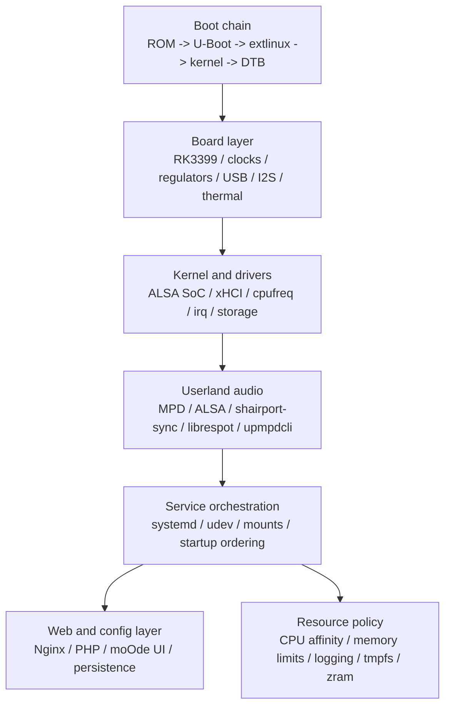

# AI Review Part 14

这是给外部 AI 做静态审查的代码分卷。每一卷都只包含仓库快照中的一部分文本文件内容，按当前工作树生成。

## `docs/archive/Android_Provisioning_App_MVP.md`

- bytes: 5169
- segment: 1/1

~~~md
# Android Provisioning App MVP

> Historical note: this file keeps the first APK MVP scope. The current APK status lives in [Android_Provisioning_App_Progress.md](/Volumes/SeeDisk/Codex/Lumelo/docs/Android_Provisioning_App_Progress.md), and the current board/app provisioning contract lives in [Provisioning_Protocol.md](/Volumes/SeeDisk/Codex/Lumelo/docs/Provisioning_Protocol.md).

This is the first Android-only app target for Lumelo Wi-Fi provisioning.

## Scope

The MVP app only does provisioning:

- scan for `Lumelo T4` over classic Bluetooth
- connect to the provisioning service over classic Bluetooth
- send Wi-Fi SSID and password
- show progress and final result
- show the Lumelo WebUI URL after the device reports an IP address

It does not implement music browsing or playback control. After Wi-Fi succeeds,
the user should open the normal WebUI.

## Screens

1. `Find Lumelo`
- Shows a single scan button
- Lists classic Bluetooth devices whose name starts with `Lumelo`
- Shows signal strength if available

2. `Connect`
- Shows the chosen device name
- Connects/pairs over classic Bluetooth
- Reads the device info JSON

3. `Wi-Fi`
- Text input for SSID
- Password input for WPA-PSK
- `Use Current Wi-Fi` shortcut to prefill the phone's current SSID when available
- Send button
- Manual `Read Status` button for bring-up retries
- Manual `Disconnect` button so the user can restart BLE pairing without force-closing the app

4. `Result`
- Shows `Applying`, `Connected`, or `Failed`
- If connected, shows `http://<device-ip>:18080/`
- If connected, automatically opens the Lumelo main interface inside the APK
- Provides open buttons for:
  - WebUI root
  - `/library`
  - `/provisioning`
  - `/logs`
  - `/healthz`
- Keeps a small on-screen debug log for scan / connect / GATT status transitions
- Allows clearing the on-screen debug log between retry attempts
- Starts a temporary automatic status polling loop after sending credentials so
  the user does not need to manually tap `Read Status` on every retry

## Android Permissions

Target Android 12+ first:

- `BLUETOOTH_SCAN`
- `BLUETOOTH_CONNECT`
- `ACCESS_FINE_LOCATION`

For older Android versions, the app may also need classic Bluetooth/location
permission fallbacks. Keep those out of the first implementation unless testing
requires them.

## Main Transport Contract

The app should use the Lumelo provisioning protocol defined in
[Provisioning_Protocol.md](/Volumes/SeeDisk/Codex/Lumelo/docs/Provisioning_Protocol.md).

Main transport:

- classic Bluetooth `RFCOMM / SPP`

Payloads remain JSON UTF-8 strings in the first version.

Client commands:

- `{"type":"device_info"}`
- `{"type":"wifi_credentials_encrypted","payload":{...}}`
- `{"type":"apply"}`
- `{"type":"status"}`

Current secure transport behavior:

- the app should inspect `hello.security`
- when `hello.security.scheme = dh-hmac-sha256-stream-v1`, the app should send
  `wifi_credentials_encrypted`
- the secure payload should carry the same logical content as plaintext
  credentials, but the Wi-Fi password must no longer appear as plaintext
  over the Bluetooth application protocol
- if the board does not advertise secure credential transport, the app should
  stop and ask for a board-side update instead of sending plaintext Wi-Fi
  credentials

Example status payload:

```json
{"type":"status","payload":{"state":"connected","ip":"192.168.1.42","web_url":"http://192.168.1.42:18080/"}}
```

The app should also tolerate richer payloads such as:

```json
{"type":"status","payload":{"state":"waiting_for_ip","message":"credentials applied; waiting for DHCP","ssid":"Home WiFi","wifi_interface":"wlan0","status_path":"/run/lumelo/provisioning-status.json"}}
```

## BLE Diagnostic Mode

`Raw BLE Scan` remains in scope as a diagnostics tool.

It is no longer the main provisioning transport, but it should continue to:

- scan nearby BLE advertisements
- list local name / UUID / manufacturer data
- help us judge whether the board is emitting any BLE signal at all

The first in-app main interface can stay thin:

- an Android `WebView`
- loads `http://<device-ip>:18080/`
- exposes quick buttons for:
  - Home
  - Library
  - Provisioning
  - Logs
  - open in external browser
  - back to setup

## Implementation Preference

Use a simple native Android project first:

- Kotlin
- Jetpack Compose
- one Activity
- no backend account
- no analytics
- no cloud dependency

The first APK can be debug-signed. Release signing and app-store polish are out
of scope for the bring-up phase.

## Validation

The APK MVP is considered usable when:

- it discovers the T4 over classic Bluetooth
- it connects without needing Linux login credentials
- it writes SSID/password
- the T4 reports either `connected` with an IP or `failed` with a readable error
- the operator can manually re-read status and disconnect without relaunching the app
- the operator can prefill the current Wi-Fi SSID from the phone when Android exposes it
- after `connected`, the APK can enter the in-app main interface without kicking the user to an external browser
- the user can open `http://<device-ip>:18080/logs` from the phone browser
~~~

## `docs/archive/Real_Device_Findings_20260412_v15.md`

- bytes: 6554
- segment: 1/1

~~~md
# 2026-04-12 `v15` 真机问题清单

适用范围：
- Rootfs: `lumelo-t4-rootfs-20260412-v15.img`
- Android APK: `lumelo-android-provisioning-20260412-classicnamefix-debug.apk`
- 记录日期：`2026-04-12`

用途：
- 汇总本轮真机测试已经坐实的结论
- 作为后续修复和回归的工作清单
- 后续问题全部修完后，可按日期和版本清理归档

追记：
- `2026-04-12` 晚些时候，清单中的两项高优先级问题已经完成代码修复：
  - 板子蓝牙冷启动自动 bring-up
  - 手机 APK 的 WebView 切网恢复崩溃
- 相关产物分别为：
  - Rootfs: [lumelo-t4-rootfs-20260412-v16.img](/Volumes/LumeloDev/Codex/Lumelo/out/t4-rootfs/lumelo-t4-rootfs-20260412-v16.img)
  - APK: [lumelo-android-provisioning-20260412-webviewpollfix-debug.apk](/Volumes/SeeDisk/Codex/Lumelo/out/android-provisioning/lumelo-android-provisioning-20260412-webviewpollfix-debug.apk)
- 本文仍保留，作为 `v15` 现场验出问题的原始清单；后续回归应以 `v16 + webviewpollfix` 为主。

## 1. 板子蓝牙

### 已确认结论
- 外接天线是必需条件。未接天线时，之前多轮“扫不到蓝牙”的判断被物理变量干扰。
- 经典蓝牙链路可用。官方金样和 Lumelo 图上都已验证到手机可发现板子经典蓝牙设备名。
- BLE 在真机上没有被稳定验证出来。官方金样下经典蓝牙可见，但手机 `Raw BLE Scan` 仍未看到稳定可用的 BLE 广播。
- 经典蓝牙 `RFCOMM` 配网主链已跑通。手机可以连接 T4 并读取 `device_info`。

### 已验出的 bug
- `v15` 开机后蓝牙并不会自动进入可连接状态。
- 根因在 [bluetooth-uart-attach](/Volumes/SeeDisk/Codex/Lumelo/base/rootfs/overlay/usr/libexec/lumelo/bluetooth-uart-attach)：
  `btmgmt info` 在“0 个控制器”时也可能返回成功，脚本把它误判成“控制器已就绪”，导致 `hciattach.rk` 被跳过。

### 待修事项
- `bluetooth-uart-attach` 的控制器就绪判断修复已打进 `v16`，下一步重点改为真机确认。
- 做一次无人工干预冷启动验证：
  冷启动后手机应能直接扫描到板子经典蓝牙并成功连接。
- 再补一轮蓝牙 patch 命中核查，确认运行态与官方金样一致。

## 2. 板子 Wi-Fi

### 已确认结论
- 官方金样的正确底座是 `bcmdhd + /system/etc/firmware vendor firmware`。
- Lumelo 早前错误地偏到了 `brcmfmac` 路线，这已经被纠正。
- 当前 Lumelo 图上，经典蓝牙下发 Wi-Fi 凭据并让 T4 成功入网已经真机跑通。
- 现场验证热点：
  `SSID=isee_test`
  `password=iseeisee`
- 成功拿到 Wi-Fi 地址：
  `192.168.43.170`
- 当前板子实际运行时走的是 `wpa_supplicant` 后备链，不是 `NetworkManager`。

### 已验出的 bug / 风险
- 当前成功入网是在手工拉起蓝牙服务后达成，不代表 `v15` 冷启动默认链路就完全没问题。
- 当前板子同时持有有线和 Wi-Fi 地址，后续页面显示和主访问地址选择还要继续观察。

### 待修事项
- 把蓝牙冷启动修复并重新回归“开机 -> 蓝牙连接 -> Wi-Fi 下发 -> connected”整链。
- 补家庭路由器场景验证，不只测手机热点。
- 验证重启后 Wi-Fi 自动回连。
- 验证双网卡 / 双 IP 下首页、配网页、状态页的地址展示是否合理。

## 3. 手机 APK

### 已确认结论
- 经典蓝牙扫描、连接、读取 `device_info`、发送 Wi-Fi 凭据，这四步已经真机跑通。
- `Lumelo Scan` 现在走经典蓝牙主通道，方向正确。

### 已修 bug
- 设备名事件归并问题：
  经典蓝牙名字有时不是首次发现就带出，App 之前会漏掉。
- 名字过滤大小写问题：
  板子对外名字实际是小写 `lumelo`，App 之前只认大写前缀，导致系统蓝牙能看到但 App 内扫不到。

### 已修 bug
- WebView 切网恢复时的崩溃问题已修复。
- 根因在 [MainInterfaceActivity.java](/Volumes/SeeDisk/Codex/Lumelo/apps/android-provisioning/app/src/main/java/com/lumelo/provisioning/MainInterfaceActivity.java)：
  `ConnectivityManager.NetworkCallback` 运行在 `ConnectivityThread`，旧实现直接在该线程更新 `TextView`，触发 `CalledFromWrongThreadException`。
- 修复后，恢复逻辑统一切回主线程执行。
- 真机回归已确认：
  - 断开手机 Wi-Fi 后，App 会停留在错误页并显示 `net::ERR_INTERNET_DISCONNECTED`
  - 重新切回与 T4 同一热点 `isee_test` 后，WebView 会自动恢复
  - 已实际恢复到 `http://192.168.43.170:18080/library`

### 已验出的 bug / 风险
- 手机恢复网络时，系统有时会优先自动连回其他已保存 Wi-Fi，例如家庭路由器 `iSee`，而不是与 T4 同一热点。
- 在这种情况下，App 现在不会崩溃，但仍会停留在错误页，直到手机重新回到与 T4 可互通的网络。

### 其他风险
- 当前 Wi-Fi 凭据通过经典蓝牙以明文 JSON 发送。
- 该方式适合开发 bring-up，不适合作为正式版最终安全方案。

### 待修事项
- 继续优化“恢复到错误 Wi-Fi”时的提示与引导，例如更明确提示当前手机所连 SSID 与 T4 不可互通。
- 继续观察不同 Android 机型在切网后的网络回调一致性，确认自动恢复逻辑是否还需要增加补偿轮询。
- 后续补配网安全方案：
  至少补配对后加密依赖或应用层会话保护。

## 4. 其他周边问题

### 已确认结论
- 主界面 `/` 正常。
- 曲库页 `/library` 正常。
- 配网页 `/provisioning` 正常。
- 播放区不是独立页面，而是嵌在首页 `/` 中。
- 播放控制基础链路可用：
  `status`
  `ping`
  `/events/playback`

### 已验出的 bug / 缺口
- 曲库当前仍为空：
  `Volumes=0`
  `Albums=0`
  `Tracks=0`
- 目前只验证到了播放控制接口可达，没有做真实音频播放回归。

### 待修事项
- 上真实曲库做一次完整回归：
  索引、列表、队列、播放、暂停、切歌。
- 把这轮真机验证沉淀成固定回归清单，至少覆盖：
  冷启动蓝牙
  经典蓝牙扫描连接
  Wi-Fi 入网
  WebUI 打开
  曲库
  播放
- 出包后增加“无手工干预上板验证”，避免出现镜像代码已修但现场仍要手工拉服务的假通过。

## 当前修复优先级
1. `v16` 上板后确认板子蓝牙冷启动自动 bring-up 是否真机闭环。
2. 继续优化手机连回错误 Wi-Fi 时的提示与恢复引导。
3. 真实曲库与真实播放回归。
4. 配网安全加固。
~~~

## `docs/archive/Repo_Rename_To_Lumelo_Checklist.md`

- bytes: 3222
- segment: 1/1

~~~md
# Lumelo 仓库目录改名前清单

## 1. 改名目标

本轮改名前的仓库根目录位于：

`/Volumes/SeeDisk/Codex/NanoPC-T4 `

当前统一后的仓库根目录为：

`/Volumes/SeeDisk/Codex/Lumelo`

这次改名不只是品牌统一，也顺带消除了旧目录名末尾的尾随空格。

## 2. 当前已确认的影响面

### A. 仓库内硬编码路径

以下文件包含写死的旧仓库根路径，改名时必须同步修改：

- `scripts/orbstack-bootstrap-lumelo-dev.sh`
  - 默认 `REPO_HOST_PATH` 曾指向 `/Volumes/SeeDisk/Codex/NanoPC-T4 `

### B. 文档中的绝对路径链接

以下文档包含基于旧仓库根路径的绝对链接，仓库目录改名后需要统一替换：

- `docs/AI_Handoff_Memory.md`
- `docs/Development_Progress_Log.md`
- `docs/archive/T4_moode_port_blueprint.md`

这些链接主要指向：

- `docs/*.md`
- `docs/archive/*.md`
- `examples/sysctl/*.sample`
- `examples/systemd/*.sample`

### C. 文档中的状态说明

以下文档里明确写着“仓库目录名当前仍然是 `NanoPC-T4`”，改名完成后应更新结论：

- `docs/AI_Handoff_Memory.md`
- `docs/Development_Progress_Log.md`

## 3. 当前不应误改的内容

以下内容即使在仓库目录改名后，通常也不应该批量替换：

- `RK3399 / NanoPC-T4` 作为当前 `V1` 硬件平台的描述
- `NanoPC-T4` 作为板卡名、Wiki 名、bring-up 说明中的硬件名
- 与 `T4` 板级、设备树、USB/I2S、DAC 相关的硬件文档语义

也就是说，这次应改的是“仓库路径/项目目录名”，不是“硬件平台名”。

## 4. 仓库外需要同步检查的项目

这些项不一定在仓库文件里，但改名时很容易受影响：

- Codex 当前工作区路径和新窗口打开路径
- Finder / IDE / 编辑器工作区收藏
- OrbStack 里引用宿主机仓库路径的命令或临时脚本
- shell 历史、别名、手工保存过的本地命令

## 5. 推荐执行顺序

1. 停掉所有仍在使用旧仓库路径的长运行进程。
2. 将仓库目录从 `/Volumes/SeeDisk/Codex/NanoPC-T4 ` 改到 `/Volumes/SeeDisk/Codex/Lumelo`。
3. 重新用新路径打开 Codex 工作区。
4. 统一替换仓库内的旧绝对路径引用。
5. 更新 `orbstack-bootstrap-lumelo-dev.sh` 的默认 `REPO_HOST_PATH`。
6. 更新交接文档里“仓库目录仍是 `NanoPC-T4`”的旧结论。
7. 跑一轮最小校验，确认没有明显残留。

## 6. 改名后建议校验

建议至少做这几项检查：

- 搜索旧绝对路径是否还有残留
- 检查 OrbStack bootstrap 脚本是否仍指向旧路径
- 检查交接文档中的可点击链接是否还能打开
- 重新跑一轮：
  - `cargo test --manifest-path services/rust/Cargo.toml`
  - `GOCACHE=/tmp/lumelo-go-build-cache GOPATH=/tmp/lumelo-go go test ./...`

## 7. 当前结论

从当前仓库扫描结果看，真正需要修改的内容并不多，难度属于中等偏低。

最主要的风险不是“改不动”，而是：

- 漏改文档里的绝对路径链接
- 忘记改 OrbStack bootstrap 脚本默认路径
- 把硬件名 `NanoPC-T4` 误当成仓库名一起替换

因此，仓库目录改名是值得做的，但建议单开一轮、一次性收口。
~~~

## `docs/archive/T4_moode_port_blueprint.md`

- bytes: 10800
- segment: 1/1

~~~md
# Archived: Lumelo 在 NanoPC-T4 / RK3399 上的 moOde 重改级移植蓝图

> 废弃说明：本文件记录的是早期 `moOde / MPD` 迁移方案。
> 当前 `Lumelo V1` 主线已明确采用 `playbackd -> ALSA hw -> DAC`，不再把 `moOde + MPD` 作为核心路线。
> 本文件仅保留作历史参考与板级 bring-up 参考，不再作为当前开发依据。

## 1. 结论

可以做，但正确目标不应是“硬改官方 Raspberry Pi 镜像”，而应是：

`Lumelo 的 RK3399 / NanoPC-T4 稳定底座` + `moOde 的音频栈、WebUI、配置逻辑移植`

这条路线更稳，也更容易维护。

建议按下面的优先级推进：

1. 先做 `TF 卡测试版`，不要一开始就写 eMMC。
2. 先打通 `USB DAC`，再碰 `I2S / overlay / DTS`。
3. 先用 `CFS + CPUAffinity + nice + ioprio`，最后才考虑 `SCHED_FIFO / SCHED_RR`。
4. 先做 `长时间稳定播放`，再做“极限低延迟”。

## 2. 目标边界

### 这次工程真正要做的

- 选择 T4 可维护的 Linux 底座
- 跑稳启动链、设备树、声卡枚举、网络、存储
- 移植 moOde 上层服务和 WebUI
- 建立面向播放器场景的内存、线程、I/O 策略
- 做一套 `TF 测试版 -> eMMC 正式版` 的发布路径

### 不建议一开始就做的

- 直接把 moOde 官方镜像改到 T4 上启动
- 一上来就开实时调度
- 没有真机日志时就硬调 ALSA period/buffer
- 还没稳住设备树和声卡链路时就追求“音质参数”

## 3. 系统分层



## 4. 底座选择

底座选型要先看音频输出方式。

### 路线 A: USB DAC 优先

适合：

- 先求稳定
- 不依赖 GPIO/I2S HAT
- 以 USB DAC 作为主输出

建议：

- 优先选 `主线程度更高的 Debian/Armbian 路线`
- 先把 `USB 音频、网络、存储、热管理` 跑稳
- 后续再移植 moOde 上层

优点：

- 板级音频和 DTS 复杂度低
- 更容易把问题隔离到用户态和资源控制层

### 路线 B: I2S/SPDIF 优先

适合：

- 你明确要接 40Pin 上的 I2S / SPDIF
- 你愿意为 DTS/驱动/时钟问题付出更多时间

建议：

- 先选 `已知对 T4 板级外设支持较完整的底座`
- 先验证 DTS、clock、pinctrl、regulator、codec 枚举

优点：

- 更贴近某些 HAT/数字输出玩法

缺点：

- 真正的难点在设备树和驱动，不在 WebUI

## 5. 分阶段实施

### M0: 板级基线

目标：

- TF 卡启动稳定
- 串口可进系统
- 千兆网、USB、存储、温控正常

交付：

- 可重复烧录的基础镜像
- 串口日志采集方法
- `dmesg`, `lsblk`, `lscpu`, `aplay -l`, `systemd-analyze blame` 基线

退出标准：

- 连续 3 次冷启动均能稳定进系统

### M1: 音频设备打通

目标：

- USB DAC 或 I2S 设备稳定枚举
- ALSA 直通可播放

交付：

- `aplay -l`, `aplay -L`, `cat /proc/asound/cards`
- 最小化 ALSA 输出配置

退出标准：

- 本地 WAV/FLAC 连续播放 2 小时无掉设备

### M2: moOde 用户态移植

目标：

- 跑通 MPD、Web 服务、配置持久化
- 跑通基础播放控制

交付：

- MPD 配置
- Nginx/PHP 基线
- 设备选择与配置写回逻辑

退出标准：

- WebUI 可控制播放、改输出设备、重启后配置不丢

### M3: 资源控制

目标：

- 背景服务不抢占关键音频路径
- 内存占用和写盘行为可控

交付：

- systemd drop-in
- sysctl 基线
- journald/tmpfs/zram 策略

退出标准：

- 扫库、Web 操作、网络访问同时存在时仍能稳定播放

### M4: 长稳与压力验证

目标：

- 验证极端场景下的稳定性

交付：

- 12h/24h 长时间播放结果
- 温度、频率、内存、xrun 观测记录

退出标准：

- 不出现播放中断、设备丢失、服务雪崩重启

### M5: 发布

目标：

- 出 `TF 测试版`
- 出 `eMMC 正式版`

交付：

- 烧录步骤
- 升级/回滚步骤
- 发布说明

## 6. CPU 与线程分配策略

RK3399 通常是：

- `CPU0-3`: Cortex-A53 小核
- `CPU4-5`: Cortex-A72 大核

但不要凭记忆写死，首轮必须先用：

```bash
lscpu -e
cat /sys/devices/system/cpu/cpu*/topology/core_type 2>/dev/null
```

确认当前内核下的核编号和聚类关系。

### 推荐的基线分工

#### 大核 A72

建议优先给：

- `mpd` 主播放和解码线程
- ALSA 输出相关线程
- 必要时给 `shairport-sync` 这类接收端服务

目标：

- 少跨核漂移
- 少被 Web/扫描/NAS 抢占
- 少受中断噪声影响

#### 小核 A53

建议优先给：

- 媒体库扫描
- `nginx` / `php-fpm`
- `smbd` / `nfs` / `upmpdcli`
- 日志、定时任务、发现服务

目标：

- 把“杂务”固定在小核
- 让大核尽量只处理关键音频链路

### 调度建议

第一阶段只做这四件事：

1. `CPUAffinity`
2. `Nice`
3. `IOSchedulingClass` / `IOSchedulingPriority`
4. `OOMScoreAdjust`

实时调度只在下面条件同时满足后再启用：

- 声卡驱动稳定
- 没有锁反转和长时间不可抢占路径
- 已通过 `cyclictest` 和长时间播放验证

### USB DAC 与 I2S 的差异

#### USB DAC

- `xHCI IRQ` 本身就是音频路径的一部分
- 不要让音频线程在大核、USB IRQ 却长期落在忙碌的小核群
- 更好的做法是让音频线程与关键 USB IRQ 至少在同一 cluster 内

#### I2S

- 更关注 `DTS / DMA / clock / pinctrl`
- 线程优化只能锦上添花，不能替代底层打通

## 7. 内存与 I/O 控制策略

### 总原则

不是一味“省内存”，而是：

- 保住关键音频进程
- 减少脏页回写造成的抖动
- 减少 flash/eMMC 的无意义写入
- 防止 Web 或扫库突然把系统顶满

### 建议的第一版策略

#### swap / zram

- 纯播优先：`不启用磁盘 swap`
- 如果要跑更多 Web/接收端/扫库：启用 `512M-1G zram`

#### 脏页回写

在 4GB 机器上，优先用 `bytes` 而不是 `ratio`：

- `vm.dirty_background_bytes = 16M`
- `vm.dirty_bytes = 64M`

这样比百分比更可控。

#### 缓存与保底空闲页

- `vm.vfs_cache_pressure = 50`
- `vm.swappiness = 10`，仅在用了 zram 时建议这样起步
- `vm.min_free_kbytes = 65536`

#### 日志

- 默认把 `journald` 设成 `volatile` 或至少加上硬上限
- 调试期短时间开持久化，稳定后再收回

#### 临时目录

- 可把 `/tmp` 放到 `tmpfs`
- 不建议一开始就把所有可写目录全搬进 RAM

### systemd 级内存保护

对背景服务做：

- `MemoryHigh`
- `MemoryMax`
- `TasksMax`
- `OOMScoreAdjust`
- `Environment=MALLOC_ARENA_MAX=2`

对关键播放服务做：

- 低 `OOMScoreAdjust`
- 尽量不做过于激进的内存硬上限

## 8. 音频链路策略

### 最小可控路径

优先目标是：

`MPD -> ALSA(hw) -> DAC`

先不要引入：

- PulseAudio
- PipeWire
- dmix
- 复杂 DSP 链

除非你明确需要它们。

### MPD 基线方向

- 直接指向 `hw:` 设备
- 关闭软件混音和软件音量
- 先用中等缓冲，别一开始就追很小的 period

建议的首轮范围：

- `audio_buffer_size`: `4096-8192 KB`
- `buffer_before_play`: `10%-20%`

这是起点，不是最终值。

### ALSA 基线方向

先确认这几件事：

- 设备名是否稳定
- 是否真的走 `hw:` 直通
- 是否绕开软件混音
- 是否出现 `xrun` / `underrun`

如果是 USB DAC：

- 先接受稍保守的 buffer
- 优先消灭中断抖动和设备掉线

如果是 I2S：

- 优先解决 DTS/驱动/时钟
- period/buffer 调优排在后面

## 9. 启动链与设备树

### 启动阶段的硬要求

- 所有内核和 DTB 修改先只在 TF 卡验证
- 保留串口日志能力
- 记录 U-Boot、kernel、DTB 的来源和版本

### 设备树的关键审查点

- `i2s` / `spdif` / `simple-audio-card`
- `clocks`
- `regulators`
- `pinctrl`
- `usb dr_mode` 与供电
- `hdmi sound` 是否和目标音频设备冲突

### 一条很重要的规则

不要让多个 DTB 来源并存并互相覆盖。

你需要一个单一真相来源：

- 这个镜像最终到底加载哪一个 `dtb`
- 它来自哪里
- 谁在打补丁

## 10. 首轮样例配置

工作区里已经放了三份保守样例：

- [docs/archive/T4_moode_port_blueprint.md](/Volumes/SeeDisk/Codex/Lumelo/docs/archive/T4_moode_port_blueprint.md)
- [examples/sysctl/90-t4-audio.conf.sample](/Volumes/SeeDisk/Codex/Lumelo/examples/sysctl/90-t4-audio.conf.sample)
- [examples/systemd/mpd.override.conf.sample](/Volumes/SeeDisk/Codex/Lumelo/examples/systemd/mpd.override.conf.sample)
- [examples/systemd/background-service.override.conf.sample](/Volumes/SeeDisk/Codex/Lumelo/examples/systemd/background-service.override.conf.sample)

这些配置的定位是：

- 作为第一轮实验基线
- 明确控制方向
- 不假装已经对你的具体 DAC、内核和镜像验证过

## 11. 哪些现在就能先做

不用等真机日志就能启动的工作：

- 目录结构和构建脚本设计
- systemd 资源控制基线
- sysctl/journald/tmpfs/zram 策略
- moOde Web/配置层的移植边界拆分
- TF 测试版与 eMMC 正式版的发布流程设计

## 12. 哪些必须等真机信息

下面这些必须拿到设备信息后才能定：

- 最终底座到底选哪条线
- I2S 是否要改 DTS，改到什么程度
- USB DAC 的 IRQ 绑核方案
- RT 优先级是否值得开
- ALSA 的最终 period/buffer
- 温控和降频策略是否要改

## 13. 你下一步应该给我的东西

如果你要我继续往“可执行工程”推进，第一批最有价值的是：

1. 当前底座镜像名称和版本
2. `uname -a`
3. `dmesg | grep -Ei "alsa|snd|i2s|usb|xhci|thermal|dvfs|mmc"`
4. `aplay -l`
5. `lsusb`
6. `systemd-analyze blame`
7. 你的输出方式：`USB DAC / I2S DAC / HDMI`

有了这些，我下一轮就可以把这份蓝图继续收敛成：

- 实际的服务分配表
- 实际的 sysctl 和 systemd drop-in
- 实际的启动顺序
- 如果需要的话，再往 DTS/驱动改造清单推进

## 14. 参考

- moOde GitHub 主页: [moode-player](https://github.com/moode-player)
- moOde 源码仓库: [moode-player/moode](https://github.com/moode-player/moode)
- moOde 发布页: [Releases](https://github.com/moode-player/moode/releases)
- FriendlyELEC NanoPC-T4 Wiki: [NanoPC-T4](https://wiki.friendlyelec.com/wiki/index.php/NanoPC-T4)
~~~

## `docs/archive/V1_Local_Mode_Function_and_Service_Spec.md`

- bytes: 19823
- segment: 1/1

~~~md
# V1 Local Mode 功能与服务规格

> Historical note: this V1 spec is archived for reference. The current product boundary and active rules are maintained in [Product_Development_Manual.md](/Volumes/SeeDisk/Codex/Lumelo/docs/Product_Development_Manual.md).

## 1. 文档目的

本文件用于定义 `Lumelo V1 Local Mode` 的实际开发边界。

其中 `Lumelo` 是产品名，当前 `V1` 的硬件平台仍然是 `RK3399 / NanoPC-T4`。

它回答的问题是：

- V1 到底做什么
- V1 不做什么
- V1 需要哪些页面
- V1 需要哪些系统服务
- `Playback Quiet Mode` 下哪些服务保留，哪些服务冻结

本文件是从产品说明书继续收敛得到的开发规格，不替代产品说明书。

## 2. V1 的一句话定义

`V1 Local Mode` 是一个 `headless`、`本地媒体优先`、`远程 WebUI 控制`、`播放时进入静默态`、`mobile-first WebUI` 的 T4 音频系统。

## 3. V1 的目标

V1 的核心目标只有六个：

1. 能稳定播放 `TF 卡` 和 `USB 存储` 中的本地音乐
2. 能通过 `Ethernet` 或 `Wi-Fi` 的远程 WebUI 控制播放
3. 播放时进入 `Playback Quiet Mode`
4. 架构上预留 `bridge mode`，但不实现 bridge 的业务功能
5. V1 只保证手机版 WebUI 的基本功能完整
6. V1 不追求桌面专用布局和视觉美化

## 4. V1 必须实现的功能

### 4.1 模式相关

V1 必须支持：

- 系统存在 `local` 和 `bridge` 两种模式枚举
- 新机器首次启动默认进入 `local`
- 启动时读取已保存模式
- 设置页可切换模式
- 切换模式后必须重启才生效
- 用户取消重启则切换无效

V1 不要求：

- 运行时热切换模式
- `bridge mode` 的真实业务功能

### 4.2 本地媒体

V1 必须支持：

- 识别并挂载 `TF 卡`
- 识别并挂载 `USB 存储`
- 浏览本地媒体
- 建立或维护本地媒体索引
- 基于本地媒体发起播放

V1 不要求：

- 网络媒体库
- NAS 媒体库
- 在线音乐服务

V1 的本地媒体模型采用以下原则：

- 默认专辑视图优先，文件夹视图作为稳定兜底
- 插盘后不自动触发全量扫库
- 播放时彻底禁止任何扫描活动
- 插盘时先完成设备识别、挂载和浅层目录建立
- 目录内容按需展开
- 全量扫库通过单独按钮手动触发
- 默认专辑视图按 `album artist` 聚合
- `ARTIST` 作为详情展示和搜索补充字段
- 允许多 `genre`
- 搜索包含目录名和文件名
- 元数据采用惰性加载
- 封面优先使用同级目录中的 `folder.jpg`
- 仅在必要时解析内嵌封面

### 4.3 播放控制

V1 必须支持：

- 播放
- 暂停
- 停止
- 上一首
- 下一首
- 播放队列
- 显示当前曲目基本信息
- `order_mode=sequential | shuffle`
- `repeat_mode=off | one | all`
- 历史播放记录入口

V1 可以弱化或不支持：

- 播放时拖动进度条
- 高精度实时进度同步
- 播放时高频状态轮询

### 4.4 网络控制

V1 必须支持：

- 有线网络控制
- Wi-Fi 网络控制
- 通过远程 WebUI 进行播放控制和设置修改

V1 不要求：

- 蓝牙承载 WebUI
- 蓝牙音频输入
- 蓝牙音频输出
- 蓝牙 App

### 4.5 设置能力

V1 必须支持以下设置项：

- 模式切换
- 网络接口模式选择
- 基础网络设置
- 本地媒体刷新或重扫触发
- 播放基础设置
- SSH 调试开关

V1 设置页不提供：

- 数字音量
- 软件音量

V1 设置系统采用以下原则：

- 静态配置与运行时状态分离
- 当前配置文件与出厂默认配置文件分离
- 配置解析失败时自动回滚到默认配置
- 配置回滚后 UI 必须给出明确警告
- SSH 默认关闭，只在设置中显式开启
- V1 提供基础登录能力
- V1 采用单管理员密码模型，不提供用户名
- 首次启动必须先设置管理密码，不提供跳过入口

## 5. V1 明确不做的内容

以下内容明确不进入 V1：

- AirPlay
- UPnP
- 网桥模式业务功能
- 蓝牙 App
- 蓝牙音频链路
- 本地接屏 GUI
- 复杂视觉效果
- 频谱显示
- 在线服务集成
- 数字音量
- 软件音量
- 艺术家 / 流派独立主导航页
- 主 `library.db` 中存封面 blob 或缩略图 blob

## 6. V1 页面清单

V1 的 WebUI 采用 `mobile-first` 策略。

边界：

- V1 只保证手机版布局和基本功能完整
- V1 不单独设计桌面专用复杂布局
- V1 不以视觉美化和动画为优先目标
- 后续版本可继续迭代版面美化与更丰富的响应式布局

### 6.0 首次设置页 / 登录页

必须支持：

- 首次启动时进入管理密码设置页
- 首次设置页仅提供：
  - 新密码
  - 确认密码
- 设置成功后自动进入已登录状态
- 后续常规访问进入登录页
- 登录页仅提供密码输入框

边界说明：

- V1 不提供用户名输入框
- V1 不提供“跳过密码”入口
- 首次设置完成前，不进入正常首页
- 整个 WebUI 在 V1 中统一要求登录后访问

密码重置规则：

- 忘记密码时，允许使用 `FAT32` 的 TF 卡或 USB 恢复介质
- 在介质根目录放置空文件 `RESET_ADMIN_PASSWORD`
- 下次开机时，系统在 `controld` 启动前检测该标记
- 若检测到，则清除管理员密码与认证会话，并重新进入首次设置流程
- 同时强制关闭 SSH，避免在密码重置后保持调试口开启
- 只在启动时检查一次，不要求运行时热插拔检测

### 6.1 首页 / 播放主界面

必须展示：

- 当前曲目信息
- 播放 / 暂停
- 上一首 / 下一首
- 队列入口
- 本地媒体入口
- 设置入口
- 明确的播放错误提示区域

设计原则：

- 页面极简
- 不依赖高频轮询
- 播放中可接受低刷新

错误提示要求：

- TF / USB 被移除时，必须明确提示对应介质不可访问
- 当前文件损坏或读不到时，必须明确提示错误原因
- 对“当前文件损坏 / 读不到”这类错误，需要显示：
  - “6 秒之后切换到下一首”
- 不要求可视化倒计时刷新
- 6 秒等待由 `playbackd` 内部维护
- 错误提示只做静态展示，不做高频刷新
- 当前运行期失败项的自动跳过由 `playbackd` 内部维护
- 用户显式点击某首失败曲目时，仍允许手动重试一次

### 6.2 本地媒体页

必须支持：

- 默认专辑封面平铺视图
- 文件夹视图
- 浏览 TF 卡媒体
- 浏览 USB 存储媒体
- 进入目录或分类
- 添加到队列
- 直接播放
- 基础搜索

专辑视图规则：

- 默认视图为 `专辑`
- 专辑聚合以 `album artist` 为主
- `ARTIST` 只用于详情展示和搜索补充，不作为专辑聚合主键
- 专辑聚合采用保守合并策略
- 同专辑不同目录默认分成两张，不主动激进合并
- 缺失 tag 时允许进入 `directory_fallback`
- `directory_fallback` 项在 UI 中可显示“目录聚合”提示
- 介质离线时可继续显示已缓存封面
- 离线专辑应标注“介质离线”
- 离线专辑不可播放
- 若当前存储尚未建立索引：
  - 显示空态提示
  - 提供“一键扫描”
  - 允许切换到文件夹视图

文件夹视图规则：

- 始终可用
- 作为索引未完成时的稳定兜底路径

设计原则：

- 默认专辑视图优先，文件夹视图兜底
- 进入目录时再展开内容
- 搜索支持目录名和文件名匹配
- 只在需要时提取曲目元数据
- 媒体定位优先使用 `volume_uuid + relative_path`
- 多碟专辑应在专辑详情页按 `Disc 1 / Disc 2` 分组展示
- 缺少 `track_no` 的曲目排在有序号曲目之后
- 同组内缺少 `track_no` 的曲目按文件名排序
- 图片缓存只提供单档 `320px` 缩略图
- 无缩略图时显示占位图，不阻塞页面
- 播放时不生成封面、不生成缩略图、不执行图片缓存清理

### 6.3 队列页

必须支持：

- 查看当前播放队列
- 删除队列项
- 在顺序模式下调整基础队列顺序
- 清空队列

边界说明：

- 队列页只负责展示和发命令
- 队列顺序、随机顺序和当前播放位以 `playbackd` 为准
- `controld` 不自行计算 `shuffle` 或更新播放指针
- `order_mode=shuffle` 时不提供手动调序入口
- `order_mode=shuffle` 下仍允许删除、清空和 `Play Now`

### 6.4 历史播放页

必须支持：

- 展示最近播放记录
- 至少保留最近 `100` 首播放记录
- 点击历史曲目后立即播放

要求：

- 历史记录只存轻量元数据
- 历史记录不参与预加载
- 点击后才触发加载和播放

### 6.5 设置页

必须支持：

- 显示当前系统模式
- 选择系统模式
- 保存模式切换并触发重启确认
- 选择网络接口模式
- 基础网络配置
- 查看系统基础状态
- 显示 SSH 当前状态
- 提供 SSH 调试开关
- 开启 SSH 前要求处于已登录状态

### 6.6 占位页

V1 需要一个 `bridge mode` 占位页，用于在该模式下提示：

- 当前模式未开放
- 相关功能将在未来版本开发

## 7. 网络接口策略

### 7.1 单接口原则

系统任一时刻只启用一种外部控制接口：

- Ethernet
- Wi-Fi
- Bluetooth Control（未来）

### 7.2 V1 实际范围

V1 实装：

- Ethernet
- Wi-Fi

V1 仅预留：

- Bluetooth Control

### 7.3 切换规则

- 用户在设置页切换接口模式
- 保存后重启生效
- 不做运行时热切换
- 未启用接口及其相关服务应关闭

## 8. Playback Quiet Mode 规格

## 8.1 进入时机

以下时机进入静默准备态：

- 用户开始本地播放
- 队列开始连续播放

正式静默态的触发边界为：

- 第一帧音频真正写入 ALSA

### 8.2 退出时机

以下时机退出静默态：

- 用户停止播放
- 队列自然播放结束
- 用户暂停播放
- 系统需要返回管理态

补充：

- 可恢复的内容错误不要求立即完全退出静默
- 对“当前文件损坏 / 读不到”这类错误，系统可进入 `quiet_error_hold`
- `quiet_error_hold` 只用于一次性错误保持与自动切歌等待

### 8.3 静默态目标

在播放期间尽量减少：

- 后台扫描
- 无关日志
- 高频 WebUI 刷新
- 封面与缩略图处理
- 非关键守护进程活动

### 8.4 静默态下允许保留的能力

必须保留：

- 当前曲目的正常播放
- 基础播放控制命令接收
- 必要网络连接
- 必要系统守护
- `PLAYBACK_PAUSED` / `PLAYBACK_RESUMED` 事件处理

对于 `quiet_error_hold`：

- 继续保持扫描冻结
- 保持控制层低活跃
- 允许 `playbackd` 内部维护一次性的 6 秒自动切歌等待

### 8.5 静默态下建议冻结或降级的能力

应冻结、暂停、降权或不启动：

- 媒体库重扫
- 封面抓取
- 缩略图生成
- 高刷新率 WebUI 状态轮询
- 非必要日志写盘
- 非关键后台任务

## 9. RAM Window Playback 规格

V1 的本地播放采用 `RAM Window Playback` 方向。

### 9.1 基本原则

目标是在播放期间尽量减少对 `TF 卡` 或 `USB 存储` 的持续访问。

默认维护一个 3 曲窗口：

- `prev`
- `current`
- `next`

### 9.2 缓存策略

推荐策略为：

- `prev`：缓存原始音频文件
- `current`：缓存原始音频文件，并拥有当前播放所需的解码缓冲
- `next`：缓存原始音频文件

说明：

- 默认缓存原始文件，不要求 3 首都完整解码为 PCM
- 当前曲目才拥有独立解码播放缓冲

### 9.3 优先级

内存窗口优先级如下：

1. `current`
2. `next`
3. `prev`

### 9.4 内存不足时的降级顺序

当内存不足时，按以下顺序降级：

1. 先释放或降级 `prev`
2. 再释放或降级 `next`
3. 始终最后才允许影响 `current`

### 9.5 回收策略

RAM Window Playback 采用：

- `优先加载`
- `延后回收`

的策略。

规则如下：

- 切歌时不要求把“新 current 加载”和“旧缓存卸载”做成一个同步动作
- 多余缓存可以先标记为 `evictable`
- 等新 `current` 已稳定进入播放后，再异步回收旧缓存

### 9.6 强制回收条件

如果系统内存接近安全阈值，则允许打破延后回收策略：

- 优先提前回收 `prev`
- 不够时再回收或降级 `next`
- 尽量不影响 `current`

### 9.7 历史曲目点击后的窗口变化

当用户点击历史播放页中的某首曲目时：

1. 当前播放立即中断
2. 原 `current` 变为新的 `prev`
3. 被点击曲目变为新的 `current`
4. 原 `next` 保持不变
5. 更旧的缓存项可标记为 `evictable`

设计说明：

- 历史曲目点击属于 `Play Now`
- 不要求重建整个队列
- 不要求历史曲目预先存在于当前队列中

## 10. 播放顺序规则

### 10.1 播放模式建模

V1 采用两段式播放模式建模：

- `order_mode`
  - `sequential`
  - `shuffle`
- `repeat_mode`
  - `off`
  - `one`
  - `all`

设计要求：

- 随机顺序始终由显式 `play_order` 表达
- `order_mode=shuffle` 且 `repeat_mode=all` 时，重复同一份 `play_order`
- 用户若想重洗随机顺序，应关闭并重新开启随机播放
- `order_mode=shuffle` 时不提供手动调序

### 10.2 顺序播放

顺序播放时：

- `play_order` 等于队列本身的顺序
- `prev/current/next` 按队列位置滑动维护

### 10.3 随机播放

随机播放时：

- 系统基于当前播放队列生成一份固定的伪随机顺序
- 随机顺序在当前队列不变时保持稳定
- 实际播放顺序以显式 `play_order` 为准
- `order_mode=shuffle` 且 `repeat_mode=all` 时，重复当前 `play_order`

### 10.4 随机顺序重建条件

V1 中随机顺序只在以下情况重建：

- 新歌加入当前队列
- 歌曲从当前队列移除
- 用户关闭并重新开启随机播放

V1 不要求：

- 单独提供“重新随机”按钮

### 10.5 队列变化时的随机顺序保护规则

当随机播放启用且队列发生变化时：

- 当前曲目保持当前播放
- 已播部分顺序保持不变
- 从“下一首开始”的剩余部分重新生成随机顺序

设计说明：

- 系统不要求额外维护一份完整历史顺序列表
- 可基于一份 `play_order` 和当前播放位置来切分：
  - 已播部分
  - 当前曲目
  - 未播部分
- `controld` 不参与队列逻辑计算，相关更新由 `playbackd` 统一完成
- 已被标记为本次运行期内容失败的曲目，在自动遍历顺序时应被跳过

### 10.6 手动调序边界

已确认：

- `order_mode=sequential` 时允许基础手动调序
- `order_mode=shuffle` 时不允许手动调序
- `order_mode=shuffle` 下仍允许：
  - 删除
  - 清空
  - `Play Now`

## 11. 跨重启恢复边界

V1 的跨重启恢复采用极简策略。

### 11.1 V1 需要恢复的内容

重启后只恢复：

- 队列内容
- 当前播放顺位
- `order_mode`
- `repeat_mode`
- 随机顺序相关状态

### 11.2 V1 不恢复的内容

V1 不恢复：

- `prev / current / next` 的 RAM 内容
- Quiet Mode 状态
- 秒级播放进度
- 自动播放中的运行状态

### 11.3 启动后的统一行为

已确认：

- 运行时状态由 `playbackd` 自行恢复
- `queue.json` 是 V1 唯一的队列恢复入口
- 系统重启后统一进入 `stopped`
- 不自动恢复播放
- 不自动恢复到某个暂停进度点

说明：

- V1 默认是 `Pure Mode`
- V1 不显示进度条，也不支持 seek
- 在该前提下，不引入 `session.json` 与周期性进度写盘，更符合极简和纯净播放原则
- 当前曲目由 `play_order + current_order_index` 推导，不单独持久化 `current_track_uid`

## 12. 服务分层

V1 建议按 4 个域管理服务：

- `core domain`
- `control domain`
- `media domain`
- `quiet-mode mutable domain`

服务形态建议：

- `playbackd`：长期常驻的核心服务
- `sessiond`：长期常驻的薄静默态服务
- `controld`：长期常驻的薄控制层服务
- `media-indexd`：按需启动的索引 worker，而不是长期高活跃常驻服务

## 13. 服务清单建议

### 13.1 core domain

这些服务属于系统核心，始终保留：

- `systemd`
- 基础挂载与本地文件系统服务
- 必要设备管理
- 播放核心服务
- 基础网络栈

这些服务的职责是：

- 保证系统能启动
- 保证本地媒体可访问
- 保证播放路径成立

其中：

- `playbackd` 属于核心域
- 它是播放状态、队列状态和 `play_order` 的唯一权威

### 13.2 control domain

这些服务属于远程控制域：

- WebUI 服务
- 基础 API 服务
- 配置服务

职责：

- 接收远程控制
- 提供设置入口
- 负责模式切换和网络设置
- 负责把用户命令转发给 `playbackd`

要求：

- 在静默态下进入低刷新、低轮询模式
- 不应在播放时做高频主动刷新

边界：

- `controld` 不自行维护队列真相
- `controld` 不自行重建 `shuffle`
- `controld` 不自行更新播放指针

### 13.3 media domain

这些服务属于本地媒体管理域：

- 本地挂载逻辑
- 本地媒体索引逻辑
- 本地重扫逻辑

职责：

- 建立本地媒体可播放条件
- 提供浏览和索引能力

运行建议：

- `media-indexd` 优先做成按需启动 worker
- 播放期间不应主动工作
- 不应感知 `playbackd` 的内部播放状态

要求：

- 非播放期可以运行
- 静默态下不得主动重扫

### 13.4 quiet-mode mutable domain

这些服务或任务在非播放期可运行，但播放期需要冻结、暂停或降级：

- 重扫任务
- 缩略图任务
- 封面处理任务
- 非关键后台整理任务

## 14. V1 服务状态矩阵

### 14.1 系统空闲态

空闲态允许：

- WebUI 正常访问
- 基础网络管理
- 本地媒体浏览
- 手动刷新媒体库
- 系统状态查看

### 14.2 本地播放静默态

静默态要求：

- 播放服务保持活跃
- WebUI 保持基本控制
- 禁止高频轮询
- 禁止媒体重扫
- 禁止非关键后台处理

### 14.3 bridge 占位态

V1 的 bridge 模式仅要求：

- 系统能正常启动
- 占位页可访问
- 本地播放服务不应启动
- 网桥业务服务不启动

## 15. 建议的启动目标

建议预留以下 systemd target 或等价编排概念：

- `local-mode.target`
- `bridge-mode.target`
- `playback-quiet.target` 或等价静默态切换机制

### 当前建议

- V1 主要实现 `local-mode.target`
- `bridge-mode.target` 只做占位
- `playback-quiet` 可以不一定做成 target，但必须有明确状态切换逻辑

### 15.1 建议启动顺序

V1 建议按以下顺序启动：

1. 基础系统、挂载和必要设备
2. `auth-recovery.service`
3. 当前启用接口所需的基础网络服务
4. `playbackd`
5. `sessiond`
6. `controld`
7. `media-indexd` 按需启动，不随常规开机自动启动

补充原则：

- `auth-recovery.service` 只在开机阶段执行一次
- `auth-recovery.service` 必须在 `controld` 启动前完成
- `playbackd` 不等待网络就绪
- `sessiond` 依赖 `playbackd`，但不依赖 `controld`
- `controld` 可依赖当前启用接口的网络基础服务
- `media-indexd` 默认不应作为长期常驻开机服务

## 16. 推荐的后续实现顺序

建议按以下顺序推进：

1. 搭建 `base/` 骨架
   - rootfs overlay
   - systemd unit
   - `auth-recovery.service`
2. 搭建 Rust workspace
   - `playbackd`
   - `sessiond`
   - `media-indexd`
   - `ipc-proto`
   - `media-model`
   - `artwork-cache`
3. 搭建 `controld`
   - 首次设置 / 登录
   - 首页 / 本地媒体 / 队列 / 历史 / 设置
4. 实现 `library.db` 与图片缓存层
5. 完成镜像、恢复和刷写链路
6. 进行联调、长稳播放和 Quiet Mode 验证

## 17. 本文件的结论

V1 不是“先做一个大系统再慢慢砍”，而是：

- 只做 `local mode`
- 只保留必要页面
- 只保留必要服务
- 把 `Playback Quiet Mode` 当作核心功能设计

这样后面不管是实现、测试还是交接，都能围绕一个明确边界来推进。
~~~

